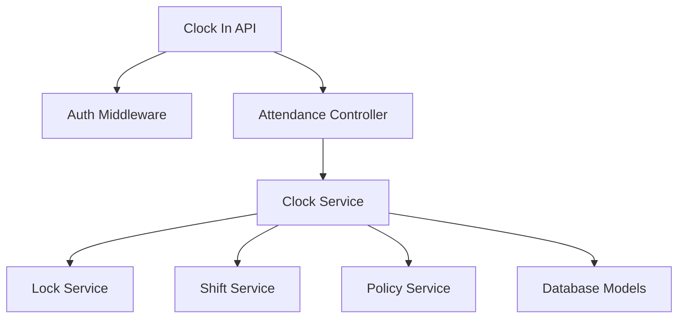

# User Attendance APIs

**Base URL:** `/api/v1/attendance` (User context)  
**Source of Truth:** `user_attendance.routes.js`, `user_attendance_read.routes.js`, `user_attendance.controller.js`, `clock.service.js`, `regularization.service.js`  
**Last Verified:** August 21, 2026

> **Note:** The specific function and ORM method names (e.g., `Organization.create()`) used in the internal execution flows are conceptual/dummy names intended to clearly illustrate the business logic. The internal execution logic, database interactions, transactions, side-effects, and validations described are strictly accurate and verified against the actual codebase.

---

## 1. Clock In

### Business Purpose
Allows an employee to mark the beginning of their workday. Captures coordinates for geofencing, calculates lateness against their assigned shift/policy, and opens an active session.

### Endpoint Contract
- **Method:** `POST`
- **Full Endpoint:** `/api/v1/attendance/clock-in`
- **Authentication:** Required. Bearer token.
- **Authorization:** All org roles (`employee`, `manager`, `hr`, `admin`, `super-admin`).
- **Feature Flag:** `attendance.access` must be enabled.

**Request Body:**
```json
{
  "source": "web",
  "latitude": 19.0760,
  "longitude": 72.8777,
  "client_timestamp": "2026-08-21T09:00:00.000Z",
  "notes": "Arrived at office",
  "work_mode": "office",
  "metadata": {}
}
```

### Validation Rules
- `source`: String. Enum: `web`, `mobile`, `api`. Default: `web`.
- `latitude`: Number. -90 to 90. Optional (but critical for geofencing).
- `longitude`: Number. -180 to 180. Optional.
- `client_timestamp`: ISO Date. Optional.
- `notes`: String. Max 500 chars. Optional.
- `work_mode`: String. Enum: `office`, `remote`, `field`, `hybrid`. Optional.

### Complete Internal Execution Flow
```text
POST /api/v1/attendance/clock-in
        ↓
AuthMiddleware.authenticate()
        ↓
AttendanceController.handleClockIn()
        ↓
ClockService.processClockIn()
        ↓
LockService.checkLock(current_date)
        ↓
AttendanceRecord.findOne() (Check for existing in_progress record)
        ↓
ShiftService.resolveShift() (Determine active shift bounds)
        ↓
PolicyService.resolvePolicy() (Determine grace period)
        ↓
Calculate Lateness (Compare current time to shift start + grace)
        ↓
BEGIN TRANSACTION
        ↓
AttendanceLog.create(type: 'clock_in')
        ↓
AttendanceRecord.create(status: 'in_progress', snapshots)
        ↓
AttendanceSession.create(status: 'open')
        ↓
Geofence Validation (calc distance between punch and org_location)
        ↓
If Out of Bounds -> AttendanceAnomaly.create()
        ↓
COMMIT TRANSACTION
        ↓
Response Formatter
        ↓
HTTP 201 Created
```

### Every Function Called
**Function**: `processClockIn(userId, orgId, payload)`
- **File**: `src/modules/attendance/services/clock.service.js`
- **Purpose**: Core orchestration of the clock-in event.
- **Why it is called**: Abstracts heavy validation and geofencing logic from the controller.
- **Database interaction**: Reads shifts/policies. Creates logs, records, sessions, and anomalies.
- **Failure behavior**: Throws `409 ALREADY_CLOCKED_IN` if session exists. Throws `403 DATE_LOCKED` if HR locked payroll for that day.

**Function**: `checkLock(orgId, date)`
- **File**: `src/modules/attendance/services/lock.service.js`
- **Purpose**: Prevents tampering with payroll.
- **Why it is called**: If HR locks August 1-15, an employee cannot spoof a clock-in for August 10.

### API Dependency Tree


### Database Operations
- **Read:** `employee_shift_assignments`, `shift_templates`, `attendance_policies`, `attendance_holidays`, `attendance_weekly_off_rules`, `calendar_exceptions`.
- **Create:** `attendance_logs`, `attendance_records`, `attendance_sessions`, `attendance_anomalies`.
- **Transaction:** Fully wrapped. If anomaly creation fails, the entire clock-in is rolled back.

### Concurrency and Race Conditions
- **Idempotency**: If the frontend retries a slow request, `AttendanceRecord.findOne` prevents creating a duplicate `in_progress` record by throwing 409. However, at extreme millisecond concurrency, race conditions could insert two records unless a database unique constraint on `(user_id, record_date)` exists.

### Side Effects
- **Anomalies**: May silently create an `out_of_bounds` anomaly if geofencing fails. The punch is accepted, but flagged for manager review.

### Response Structure
**201 Created**
```json
{
  "success": true,
  "message": "Clocked in successfully",
  "data": {
    "log_id": "uuid",
    "record_id": "uuid",
    "session_id": "uuid",
    "clock_in_time": "2026-08-21T09:05:00.000Z",
    "shift": { "name": "General", "start_time": "09:00", "end_time": "18:00", "type": "fixed" },
    "late_minutes": 5,
    "within_grace": true,
    "is_holiday": false,
    "is_weekly_off": false
  }
}
```

### Error Flow
- `409 ALREADY_CLOCKED_IN` - User already has an active session today.
- `403 DATE_LOCKED` - HR has locked attendance modifications for this date.

### Frontend Integration
- **When to call**: When user taps "Clock In" on the dashboard.
- **Required Data**: Extract `latitude` and `longitude` from the browser's Geolocation API.
- **UI State**: Transition dashboard from "Clock In" button to "Clock Out / Break" buttons, and start a live elapsed timer.

---

## 2. Clock Out

### Business Purpose
Marks the end of the workday. Auto-closes any active breaks, calculates total/effective hours, overtime, early exit, and determines the final daily status (Present, Half Day, Absent).

### Endpoint Contract
- **Method:** `POST`
- **Full Endpoint:** `/api/v1/attendance/clock-out`
- **Authentication:** Required. Bearer token.
- **Authorization:** All org roles.

**Request Body:** Same as Clock In (`source`, `latitude`, `longitude`, `notes`).

### Complete Internal Execution Flow
```text
POST /api/v1/attendance/clock-out
        ↓
AuthMiddleware.authenticate()
        ↓
AttendanceController.handleClockOut()
        ↓
ClockService.processClockOut()
        ↓
LockService.checkLock()
        ↓
AttendanceRecord.findOne(in_progress)
        ↓
BEGIN TRANSACTION
        ↓
Is Break Active? -> Close Break (AttendanceBreak.update)
        ↓
AttendanceLog.create(type: 'clock_out')
        ↓
AttendanceSession.update(status: 'closed')
        ↓
AttendanceRecord.update(clock_out_time)
        ↓
Geofence Validation
        ↓
CalculationService.calculateRecord()
        ↓
Evaluate hours against Policy thresholds (Half Day, Absent, Overtime)
        ↓
AttendanceRecord.update(final_status, effective_hours, overtime)
        ↓
COMMIT TRANSACTION
        ↓
HTTP 200 OK
```

### Every Function Called
**Function**: `calculateRecord(recordId, transaction)`
- **File**: `src/modules/attendance/services/calculation.service.js`
- **Purpose**: Extremely heavy calculation engine that determines the final business interpretation of the day's logs.
- **Why it is called**: To compute `effective_hours` (subtracting breaks) and compare it against the snapshot of the policy thresholds to determine if the user gets a Half Day or Full Day.
- **Output**: Updates the `attendance_records` row.

### Database Operations
- **Update:** `attendance_breaks` (if open), `attendance_sessions`, `attendance_records`.
- **Create:** `attendance_logs`.
- **Transaction:** Fully wrapped.

### Response Structure
**200 OK**
```json
{
  "success": true,
  "message": "Clocked out successfully",
  "data": {
    "record_id": "uuid",
    "clock_in_time": "2026-08-21T09:00:00.000Z",
    "clock_out_time": "2026-08-21T18:00:00.000Z",
    "total_hours": "9.00",
    "effective_hours": "8.00",
    "break_duration_minutes": 60,
    "late_minutes": 0,
    "early_exit_minutes": 0,
    "overtime_minutes": 0,
    "status": "present",
    "half_day_type": null
  }
}
```

---

## 3. Break Start / End

### Business Purpose
Tracks temporary pauses in work. Time spent on break is subtracted from `effective_hours` to ensure accurate payroll.

### Endpoint Contract
- **Method:** `POST`
- **Full Endpoints:** 
  - `/api/v1/attendance/break/start`
  - `/api/v1/attendance/break/end`
- **Authentication:** Required. Bearer token.
- **Authorization:** All org roles.

### Complete Internal Execution Flow (Break End)
```text
POST /break/end
        ↓
AuthMiddleware.authenticate()
        ↓
AttendanceController.handleBreakEnd()
        ↓
ClockService.processBreakEnd()
        ↓
Find active break
        ↓
BEGIN TRANSACTION
        ↓
AttendanceLog.create(type: 'break_end')
        ↓
AttendanceBreak.update(end_time, duration)
        ↓
Policy check: Did break exceed policy limit?
        ↓
If Yes -> AttendanceAnomaly.create(excessive_break)
        ↓
COMMIT TRANSACTION
        ↓
HTTP 200 OK
```

### Internal Working
- **Start:** Throws 400 if not clocked in, or if a break is already active. Checks policy limit `max_breaks_per_day`. Creates `break_start` log and `attendance_breaks` record.
- **End:** Throws 400 if no active break. Creates `break_end` log, updates break duration. If duration exceeds `policy.max_break_duration_minutes`, logs an `excessive_break` anomaly.

---

## 4. Get Today's Status

### Purpose
Fetches the current live state of the user's attendance for the day, used to drive the frontend Clock In/Out UI (showing the timer, active break, and buttons).

### Endpoint Contract
- **Method:** `GET`
- **Full Endpoint:** `/api/v1/attendance/today`

### Response Structure
**200 OK**
```json
{
  "success": true,
  "data": {
    "date": "2026-08-21",
    "status": "in_progress", // or not_marked, holiday, weekly_off, present
    "clock_in_time": "2026-08-21T09:00Z",
    "clock_out_time": null,
    "effective_hours": "4.50",
    "active_break": null,
    "breaks": [...],
    "shift": { "name": "General", "start_time": "09:00", "end_time": "18:00" },
    "is_holiday": false,
    "is_weekly_off": false
  }
}
```
**Frontend Integration:**
- If `status === 'not_marked'`, show "Clock In" button.
- If `status === 'in_progress'` and `active_break === null`, show "Clock Out" and "Start Break" buttons.
- If `status === 'in_progress'` and `active_break !== null`, show "End Break" button.

---

## 5. Submit Regularization Request

### Business Purpose
Allows an employee to request a manual correction to their attendance (e.g., forgot to clock out, network failure). This creates a pending request for Managerial approval.

### Endpoint Contract
- **Method:** `POST`
- **Full Endpoint:** `/api/v1/attendance/regularization`
- **Authentication:** Required. Bearer token.
- **Authorization:** All org roles.

### Request Structure
**Body:**
```json
{
  "date": "2026-08-20",
  "requested_clock_in": "2026-08-20T09:00:00.000Z",
  "requested_clock_out": "2026-08-20T18:00:00.000Z",
  "reason": "Forgot to clock out due to urgent meeting"
}
```

### Validation Rules
- `date`: ISO Date. Required. Must be in the past (cannot regularize future dates).
- `requested_clock_in`/`out`: ISO Dates. Optional.
- `reason`: String. Min 5, Max 1000. Required.

### Complete Internal Execution Flow
```text
POST /api/v1/attendance/regularization
        ↓
AuthMiddleware.authenticate()
        ↓
RegularizationController.handleSubmitRequest()
        ↓
RegularizationService.createRequest()
        ↓
LockService.checkLock()
        ↓
Check existing pending requests for date (Throws 409 if exists)
        ↓
Fetch existing AttendanceRecord (Create empty absent record if none exists)
        ↓
UserReportingMapping.findOne() (Find manager_id)
        ↓
AttendanceRegularizationRequest.create(status: pending, manager_id)
        ↓
Side Effect: NotificationService.notifyManager() (If implemented)
        ↓
HTTP 201 Created
```

### Database Operations
- **Read:** `attendance_regularization_requests`, `user_reporting_mappings`.
- **Create:** `attendance_regularization_requests`.
- **Transactions:** Required if an empty record needs to be created simultaneously.

### What Can Break If This API Changes?
- The Manager's dashboard reads directly from the `attendance_regularization_requests` table filtering by `manager_id`. If the mapping logic fails, the request will be orphaned and the employee can never get it approved.

### Response Structure
**201 Created**
```json
{
  "success": true,
  "message": "Regularization request submitted",
  "data": {
    "request_id": "uuid",
    "status": "pending"
  }
}
```

---

## 6. Cancel Regularization Request

### Business Purpose
Withdraws the user's own pending regularization request. Implements transaction + LOCK.UPDATE row lock, self-ownership check, and status re-check to reject already-processed requests, closing the lost-update window. Status updated to `cancelled` (STRING(20)).

### Endpoint Contract
- **Method:** `POST`
- **Full Endpoint:** `/api/v1/attendance/regularizations/:id/cancel`
- **Authentication:** Required. Bearer token.
- **Authorization:** All org roles.

### Request Structure
**Path Parameter:** `id` (UUIDv4) - The regularization request ID.
**Body:** None.

---

## 7. Get My Overtime

### Business Purpose
Fetches the user's own overtime requests with pagination (limit ≤ 100). Reuses `overtimeService.getEmployeeOvertime`.

### Endpoint Contract
- **Method:** `GET`
- **Full Endpoint:** `/api/v1/attendance/overtime/mine`
- **Authentication:** Required. Bearer token.
- **Authorization:** All org roles.

### Request Structure
**Query Parameters:**
- `page`, `limit` (Optional)

---

## 8. Get My Anomalies

### Business Purpose
Fetches the user's own attendance anomalies (e.g., GPS breaches). Includes pagination and status filtering.

### Endpoint Contract
- **Method:** `GET`
- **Full Endpoint:** `/api/v1/attendance/anomalies/mine`
- **Authentication:** Required. Bearer token.
- **Authorization:** All org roles.

### Request Structure
**Query Parameters:**
- `status`: Enum (`open`, `resolved`, `all`). Optional.
- `page`, `limit` (Optional)

---

## 9. Get Attendance History

### Business Purpose
Fetches paginated historical attendance records for the authenticated user, optionally filtered within a date range (`from` and `to`).

### Endpoint Contract
- **Method:** `GET`
- **Full Endpoint:** `/api/v1/attendance/history`
- **Authentication:** Required. Bearer token.
- **Authorization:** All org roles (`employee`, `manager`, `hr`, `admin`, `super-admin`).
- **Feature Flag:** `attendance.access` must be enabled.

### Request Structure
**Query Parameters:**
- `from`: ISO Date (Optional). Start date filter.
- `to`: ISO Date (Optional). End date filter.
- `page`: Integer $\ge 1$, default 1 (Optional).
- `limit`: Integer 1–100, default 20 (Optional).

### Response Structure
**200 OK**
```json
{
  "success": true,
  "message": "Attendance history fetched",
  "data": {
    "records": [
      {
        "id": "uuid",
        "date": "2026-08-20",
        "status": "present",
        "clock_in_time": "2026-08-20T09:02:00.000Z",
        "clock_out_time": "2026-08-20T18:05:00.000Z",
        "effective_hours": "8.50",
        "late_minutes": 2,
        "early_exit_minutes": 0,
        "overtime_minutes": 0
      }
    ],
    "pagination": { "total": 1, "page": 1, "limit": 20, "totalPages": 1 }
  }
}
```

---

## 10. Get Monthly Summary

### Business Purpose
Returns aggregated attendance metrics (total working days, days present, half days, absences, late arrivals, total overtime) for a given month and year.

### Endpoint Contract
- **Method:** `GET`
- **Full Endpoint:** `/api/v1/attendance/summary`
- **Authentication:** Required. Bearer token.
- **Authorization:** All org roles.

### Request Structure
**Query Parameters:**
- `month`: Integer (1–12, Optional, defaults to current month).
- `year`: Integer (2000–2100, Optional, defaults to current year).

### Response Structure
**200 OK**
```json
{
  "success": true,
  "message": "Monthly summary fetched",
  "data": {
    "total_days": 31,
    "present_days": 21,
    "half_days": 1,
    "absent_days": 0,
    "on_leave_days": 1,
    "holidays": 1,
    "weekly_offs": 8,
    "late_days": 2,
    "total_effective_hours": "178.50",
    "total_overtime_minutes": 60
  }
}
```

---

## 11. Get Active Shift Details

### Business Purpose
Fetches the currently effective shift template details assigned to the authenticated user (start time, end time, work days, grace minutes).

### Endpoint Contract
- **Method:** `GET`
- **Full Endpoint:** `/api/v1/attendance/shift`
- **Authentication:** Required. Bearer token.
- **Authorization:** All org roles.

### Response Structure
**200 OK**
```json
{
  "success": true,
  "message": "Current shift fetched",
  "data": {
    "shift_id": "uuid",
    "name": "General Day Shift",
    "start_time": "09:00",
    "end_time": "18:00",
    "shift_type": "fixed",
    "policy": {
      "grace_minutes": 15,
      "half_day_threshold_minutes": 240,
      "full_day_threshold_minutes": 480
    }
  }
}
```

---

## 12. List My Regularization Requests

### Business Purpose
Fetches a paginated history of regularization requests submitted by the employee, filterable by status.

### Endpoint Contract
- **Method:** `GET`
- **Full Endpoint:** `/api/v1/attendance/regularizations`
- **Authentication:** Required. Bearer token.
- **Authorization:** All org roles.

### Request Structure
**Query Parameters:**
- `status`: String enum (`pending`, `approved`, `rejected`, `cancelled`, `all`, Optional).
- `page`: Integer $\ge 1$, default 1 (Optional).
- `limit`: Integer 1–100, default 20 (Optional).

### Response Structure
**200 OK**
```json
{
  "success": true,
  "message": "Regularizations fetched",
  "data": {
    "requests": [
      {
        "id": "uuid",
        "date": "2026-08-19",
        "requested_clock_in": "2026-08-19T09:00:00.000Z",
        "requested_clock_out": "2026-08-19T18:00:00.000Z",
        "reason": "Forgot to clock out due to urgent meeting",
        "status": "pending",
        "created_at": "2026-08-20T08:00:00.000Z"
      }
    ],
    "pagination": { "total": 1, "page": 1, "limit": 20, "totalPages": 1 }
  }
}
```

---

## 13. List My Comp Off Requests

### Business Purpose
Fetches the user's earned compensatory-off records and their lifecycle statuses (`earned`, `approved`, `used`, `expired`, `cancelled`).

### Endpoint Contract
- **Method:** `GET`
- **Full Endpoint:** `/api/v1/attendance/comp-offs/mine`
- **Authentication:** Required. Bearer token.
- **Authorization:** All org roles.

### Request Structure
**Query Parameters:**
- `status`: String enum (`earned`, `approved`, `used`, `expired`, `cancelled`, Optional).
- `page`: Integer $\ge 1$, default 1 (Optional).
- `limit`: Integer 1–100, default 20 (Optional).

---

## 14. Get My Comp Off Balance Summary

### Business Purpose
Returns a summary of the employee's current comp-off credits (total earned, available/approved balance, used, and expired).

### Endpoint Contract
- **Method:** `GET`
- **Full Endpoint:** `/api/v1/attendance/comp-offs/mine/summary`
- **Authentication:** Required. Bearer token.
- **Authorization:** All org roles.

### Response Structure
**200 OK**
```json
{
  "success": true,
  "message": "Your comp-off summary fetched",
  "data": {
    "available_balance": 2,
    "total_earned": 3,
    "used_days": 1,
    "expired_days": 0
  }
}
```

---

## 15. Get Daily Attendance Log

### Business Purpose
Returns a detailed, minute-by-minute breakdown of every punch, break segment, active session, and anomaly recorded on a specific date.

### Endpoint Contract
- **Method:** `GET`
- **Full Endpoint:** `/api/v1/attendance/daily-log`
- **Authentication:** Required. Bearer token.
- **Authorization:** All org roles.

### Request Structure
**Query Parameters:**
- `date`: ISO Date string (`YYYY-MM-DD`, Optional, defaults to today).

---

## 16. Get Monthly Graph Data

### Business Purpose
Returns aggregated time-series data points (day-by-day effective hours and status) to render user attendance trend charts.

### Endpoint Contract
- **Method:** `GET`
- **Full Endpoint:** `/api/v1/attendance/graph-data`
- **Authentication:** Required. Bearer token.
- **Authorization:** All org roles.

### Request Structure
**Query Parameters:**
- `month`: Integer (1–12, Optional).
- `year`: Integer (2000–2100, Optional).

---

## 17. Get Attendance Trends

### Business Purpose
Analyzes punctuality patterns over the past $N$ months (average hours, on-time percentage, late count trends).

### Endpoint Contract
- **Method:** `GET`
- **Full Endpoint:** `/api/v1/attendance/trends`
- **Authentication:** Required. Bearer token.
- **Authorization:** All org roles.

### Request Structure
**Query Parameters:**
- `months`: Integer (1–12, default 3, Optional).

---

## 18. Get Weekly Calendar View

### Business Purpose
Fetches a 7-day week schedule breakdown centered on a target date, identifying shift timing, working days, holidays, and recorded punches.

### Endpoint Contract
- **Method:** `GET`
- **Full Endpoint:** `/api/v1/attendance/weekly-calendar`
- **Authentication:** Required. Bearer token.
- **Authorization:** All org roles.

### Request Structure
**Query Parameters:**
- `date`: ISO Date string (`YYYY-MM-DD`, Optional).

---

## 19. Get Applicable Holidays

### Business Purpose
Fetches the list of upcoming organizational and location-specific holidays applicable to the authenticated user for a given year.

### Endpoint Contract
- **Method:** `GET`
- **Full Endpoint:** `/api/v1/attendance/holidays`
- **Authentication:** Required. Bearer token.
- **Authorization:** All org roles.

### Request Structure
**Query Parameters:**
- `year`: Integer (2000–2100, Optional, defaults to current year).

### Response Structure
**200 OK**
```json
{
  "success": true,
  "message": "Holidays fetched",
  "data": [
    {
      "id": "uuid",
      "name": "Independence Day",
      "date": "2026-08-15",
      "is_optional": false
    }
  ]
}
```


