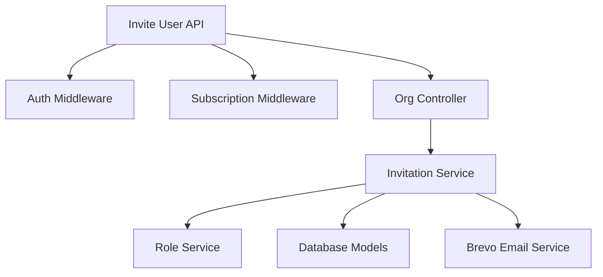

# Organization Invitation APIs

**Base URL:** `/api/v1/organizations/invitations`  
**Source of Truth:** `organization.routes.js`, `organization.controller.js`, `invitation.service.js`  
**Last Verified:** August 21, 2026

> **Note:** The specific function and ORM method names (e.g., `Organization.create()`) used in the internal execution flows are conceptual/dummy names intended to clearly illustrate the business logic. The internal execution logic, database interactions, transactions, side-effects, and validations described are strictly accurate and verified against the actual codebase.

---

## 1. Invite User

### Business Purpose
Allows an HR or Manager to invite a new or existing user into their organization. This API handles complex logic including: checking subscription limits, checking hierarchical role priorities, establishing reporting lines, assigning department/location, and designating Heads of Departments (HOD). It dispatches an email with a secure token link.

### Endpoint Contract
- **Method:** `POST`
- **Full Endpoint:** `/api/v1/organizations/users/invite`
- **Authentication:** Required. Bearer token.
- **Authorization:** `super-admin`, `admin`, `hr`, `manager`.
- **Policy:** The inviter cannot invite someone to a role that has a higher priority than their own (e.g., a Manager cannot invite an HR). Enforced via `checkInvitationPolicy`.
- **Content-Type:** `application/json`

**Request Body:**
```json
{
  "email": "john.doe@example.com",
  "role": "employee",
  "name": "John Doe",
  "department_id": "uuid-v4",
  "make_hod": false,
  "reporting_person": "manager-uuid-v4",
  "location_id": "uuid-v4",
  "designation": "Software Engineer",
  "emp_id": "EMP-001",
  "work_mode": "hybrid",
  "contact": "+1234567890"
}
```

### Validation Rules
- `email`: String. Required. Valid email format.
- `role`: String. Required. Enum: `hr`, `manager`, `employee`.
- `name`: String. Optional.
- `department_id`: UUIDv4. Optional.
- `make_hod`: Boolean. Optional. Default `false`. If true, `role` cannot be `employee`.
- `reporting_person`: UUIDv4. Optional. Must point to a user with `hr` or `manager` role in the org.
- `location_id`: UUIDv4. Optional.
- `work_mode`: String. Enum: `wfo`, `wfh`, `hybrid`. Optional.

### Complete Internal Execution Flow
```text
POST /api/v1/organizations/users/invite
        ↓
AuthMiddleware.authenticate()
        ↓
AuthMiddleware.authorize(['super-admin', 'admin', 'hr', 'manager'])
        ↓
SubscriptionMiddleware.requireSubscription() (Limits check)
        ↓
OrganizationController.handlePostInviteUser()
        ↓
InvitationService.inviteUser()
        ↓
RoleService.checkInvitationPolicy()
        ↓
User.findOne(email)
        ↓
If New: User.create(pending_verification)
If Existing: Verify no duplicate membership / pending invite
        ↓
UserProfile.upsert() (Split name)
        ↓
EmployeeProfile / ManagerProfile / HrProfile .upsert()
        ↓
Department/Location Validation (If HOD/Manager logic applies)
        ↓
UserReportingMapping.create() (Pending status)
        ↓
Invitation.create() (Generate Hex Token)
        ↓
Brevo (External Email API)
        ↓
Response Formatter
        ↓
HTTP 200 OK
```

### Every Function Called

**Function**: `inviteUser(inviterId, orgId, payload)`
- **File**: `src/modules/organization/services/invitation.service.js`
- **Purpose**: Core orchestration of creating a user profile, establishing hierarchy, and sending the invite email.
- **Why it is called**: Abstracts heavy business logic from the controller.
- **Input**: Inviter's ID, Organization ID, Payload (email, role, department, etc.).
- **Output**: `{ target_user_id: uuid }`
- **Database interaction**: Reads `users`, `roles`. Creates/Upserts `users`, `user_profiles`, `hr/manager/employee_profiles`, `user_reporting_mappings`, `invitations`.
- **Side effects**: Dispatches an email via Brevo.
- **Failure behavior**: Throws `AppError` if role priority is violated or user is already in the org.

**Function**: `checkInvitationPolicy(inviterRoleId, targetRoleKey)`
- **File**: `src/modules/organization/services/role.service.js`
- **Purpose**: Prevents privilege escalation.
- **Why it is called**: A manager should not be able to invite someone as an HR.
- **Input**: Inviter's Role UUID, Target Role String (e.g. 'hr').
- **Failure behavior**: Throws `403 FORBIDDEN_PRIORITY`.

### Services Used by the API
- **InvitationService**: Handles the invitation workflow.
- **RoleService**: Enforces role hierarchy rules.
- **BrevoService**: Sends the email payload.

### API Dependency Tree


### Database Operations
- **Read**: `roles`, `users` (by email), `user_roles` (check duplicate), `invitations` (check active), `organizations`, `organization_departments`.
- **Create/Upsert**:
  - `users` (If new, `status = pending_verification`).
  - `user_profiles` (`first_name`, `last_name`).
  - Role-specific profiles (`employee_profiles`, etc.).
  - `user_reporting_mappings` (Creates relationship with `active_from: null`).
  - `invitations` (Generates token).
- **Transactions**: Note: This is *not* fully wrapped in a single transaction in the current implementation, which is a potential data integrity risk if the email fails to send after profiles are created.

### Explain Database Model Relationships
- **User ↔ UserReportingMapping**: The API establishes who the invitee will report to. This relationship is created immediately but left inactive (`active_from: null`) until the user accepts the invitation.
- **Organization ↔ Invitations**: The invitation is tied to the specific organization so the user doesn't accidentally accept an invite to the wrong tenant.

### Concurrency and Race Conditions
- **Idempotency**: If the HR clicks "Invite" twice rapidly, the second request will hit the `invitations` or `user_roles` check and throw `409 INVITATION_ALREADY_EXISTS` or `409 DUPLICATE_MEMBERSHIP`.

### External Services
- **Brevo (Sendinblue)**
  - **Why**: Sends the invitation email containing the unique acceptance URL.
  - **Auth Method**: API Key.
  - **Sync/Async**: Synchronous. If the email API times out, the backend returns an error.

### Response Construction
Database result (target user ID) → InvitationService → OrganizationController → HTTP Response.

**200 OK**
```json
{
  "success": true,
  "message": "Invitation sent successfully",
  "data": {
    "target_user_id": "uuid-v4"
  }
}
```

### Error Flow
| Status | Code | Cause |
|---|---|---|
| 400 | `INVALID_ROLE` | Role doesn't exist. |
| 400 | `INVALID_HOD_ROLE` | Tried to make an employee an HOD. |
| 403 | `FORBIDDEN_PRIORITY` | Inviter lacks authority to assign requested role. |
| 409 | `DUPLICATE_MEMBERSHIP` | User is already in the org. |
| 409 | `INVITATION_ALREADY_EXISTS` | A pending invitation is already active. |

### Frontend Integration
- **When to Call:** When an admin submits the "Add Employee" form.
- **Required Data:** The form fields. Ensure `make_hod` is unchecked/disabled if the selected role is "employee".
- **What should happen on success:** Show a toast notification "Invite sent". Refresh the employee table if it has a "Pending Invites" tab.
- **Does UI need to refresh?** Yes, to show the new pending invite.

### Side Effects
- **Reporting Mapping Creation**: Stubs out a pending reporting relationship.
- **Email**: Dispatches external email.

### What Can Break If This API Changes?
- **Attendance Module Visibility**: If the logic that sets `reporting_person` breaks, the Attendance module will fail because managers rely on `user_reporting_mappings` to see their team's clock-ins.

### Critical Invariants
- An employee role cannot be an HOD.
- An inviter cannot grant a role higher than their own hierarchy level.

---

## 2. Validate Invitation

### Business Purpose
When a user clicks the invitation link in their email, the frontend uses this API to validate the token and fetch organization details to display on the "Accept Invitation" landing page.

### Endpoint Contract
- **Method:** `GET`
- **Full Endpoint:** `/api/v1/organizations/invitations/validate`
- **Authentication:** Not required.

### Request Structure
**Query Parameters:**
- `token`: String. Required. The token from the email URL.

### Complete Internal Execution Flow
```text
GET /api/v1/organizations/invitations/validate?token=xxx
        ↓
OrganizationController.handleGetValidateInvitation()
        ↓
InvitationService.validateToken()
        ↓
Redis.get(`org_invite:${hash}`)
        ↓
User.findOne() (Check if pending_verification)
        ↓
OrganizationProfile.findOne() (Fetch branding)
        ↓
HTTP 200 OK
```

### Cache / Redis Behavior
- **Read**: Looks up `org_invite:<hash>` in Redis. This is used for fast validation before hitting the database. If it's missing or expired, it returns 400.

### Response Construction
**200 OK**
```json
{
  "success": true,
  "data": {
    "org_id": "uuid-v4",
    "role": "employee",
    "email": "user@example.com",
    "is_new_user": true,
    "org_name": "Tech Corp",
    "org_logo": "url...",
    "org_description": "..."
  }
}
```

### Frontend Integration
- **When to Call:** Immediately when the user lands on the `/invitation/accept` route.
- **Frontend Response Handling:**
  - If success: Render the accept page. Show org branding. If `is_new_user` is true, render a password input field. If false, just render an "Accept" button.
  - If error (400): Show "Invalid or Expired Link" error state.

---

## 3. Accept Invitation

### Business Purpose
Completes the invitation flow. The user formally joins the organization. Evaluates subscription limits before granting access. Automatically executes any pending Head of Department (HOD) transfers and activates pending reporting line mappings.

### Endpoint Contract
- **Method:** `POST`
- **Full Endpoint:** `/api/v1/organizations/invitations/accept`
- **Authentication:** Required ONLY IF `is_new_user` is false (meaning they are an existing active user). Middleware: `authenticateOptional`.

**Request Body:**
```json
{
  "token": "hex-token",
  "password": "Password@123" // Only required if new user
}
```

### Complete Internal Execution Flow
```text
POST /api/v1/organizations/invitations/accept
        ↓
AuthMiddleware.authenticateOptional()
        ↓
OrganizationController.handlePostAcceptInvitation()
        ↓
InvitationService.acceptInvitation()
        ↓
Validate Token against Redis & DB
        ↓
Check User Status (If pending, requires password)
        ↓
BEGIN TRANSACTION
        ↓
Organization.findOne() (Check if org is active)
        ↓
EntitlementService.requireFeature() (Check limits)
        ↓
UserRole.create()
        ↓
User.update(status: active, password_hash) (If new user)
        ↓
executeHODTransfer() (If role requires it)
        ↓
UserReportingMapping.update(active_from: NOW())
        ↓
Redis.del() (Consume token)
        ↓
COMMIT TRANSACTION
        ↓
HTTP 200 OK
```

### Explain Transactions
- **Transaction Starts:** Before any structural changes are made.
- **Atomic Operations:** 
  - Creating `user_roles`.
  - Activating `users` record.
  - Swapping `head_of_department_id` in `organization_departments`.
  - Activating `user_reporting_mappings`.
- **Why it exists:** If a network failure occurs during the HOD swap, the department would be left corrupted. The transaction ensures either the user joins and hierarchy is updated, or nothing happens.

### Important Side Effects
- **HOD Transfer Execution:** This is critical. The HOD transfer is *staged* during the Invite step, but only *executed* during the Accept step. This prevents a department from being left headless if an invited manager never accepts.
- **Reporting Activation:** Subordinates will not see this new user as their manager until this API is successfully called and `active_from` is set.

### What Can Break If This API Changes?
- **Billing Integrity**: If the `EntitlementService` check is bypassed, organizations could invite infinite employees on a Free plan.

### Response Structure
**200 OK**
```json
{
  "success": true,
  "message": "Invitation accepted successfully"
}
```

### Frontend Integration
- **When to Call:** When the user clicks "Accept Invitation" (and submits password if new).
- **Frontend Response Handling:**
  - On success: Navigate user to the Login page. (They must log in to obtain JWT tokens scoped to their new organization).

---

## 4. Revoke Invitation

### Business Purpose
Allows HR/Admin to cancel a pending invitation before the user accepts it, invalidating the email token and deactivating any staged hierarchical mappings.

### Endpoint Contract
- **Method:** `POST`
- **Full Endpoint:** `/api/v1/organizations/users/invite/revoke`
- **Authentication:** Required.
- **Authorization:** `super-admin`, `admin`, `hr`, `manager`.

**Request Body:**
```json
{
  "email": "user@example.com"
}
```

### Complete Internal Execution Flow
```text
POST /users/invite/revoke
        ↓
OrganizationController.handlePostRevokeInvitation()
        ↓
InvitationService.revokeInvitation()
        ↓
RoleService.checkInvitationPolicy()
        ↓
Invitation.destroy()
        ↓
Redis.del()
        ↓
UserReportingMapping.update(is_active: false, reason: "Revoked")
        ↓
HTTP 200 OK
```

### Database Operations
- **Deletes**: `invitations` row.
- **Updates**: Soft-deletes `user_reporting_mappings`.

### Response Structure
**200 OK**
```json
{
  "success": true,
  "message": "Invitation revoked successfully"
}
```

---

## 5. Resend Invitation

### Business Purpose
Revokes the old invitation token and generates a new one, dispatching a fresh email to the user.

### Endpoint Contract
- **Method:** `POST`
- **Full Endpoint:** `/api/v1/organizations/users/invite/resend`
- **Authentication:** Required.
- **Authorization:** `super-admin`, `admin`, `hr`, `manager`.

**Request Body:**
```json
{
  "email": "user@example.com"
}
```

### Complete Internal Execution Flow
```text
POST /users/invite/resend
        ↓
InvitationService.resendInvitation()
        ↓
Find active invitation
        ↓
Extract role_key from payload
        ↓
Revoke old invitation (InvitationService.revokeInvitation)
        ↓
Generate new token (InvitationService.inviteUser)
        ↓
Dispatch Brevo Email
        ↓
HTTP 200 OK
```

### Side Effects
- Dispatches a new email. Old email links instantly become invalid (400 Bad Request).

### Response Structure
**200 OK**
```json
{
  "success": true,
  "message": "Invitation sent successfully",
  "data": {
    "target_user_id": "uuid-v4"
  }
}
```
