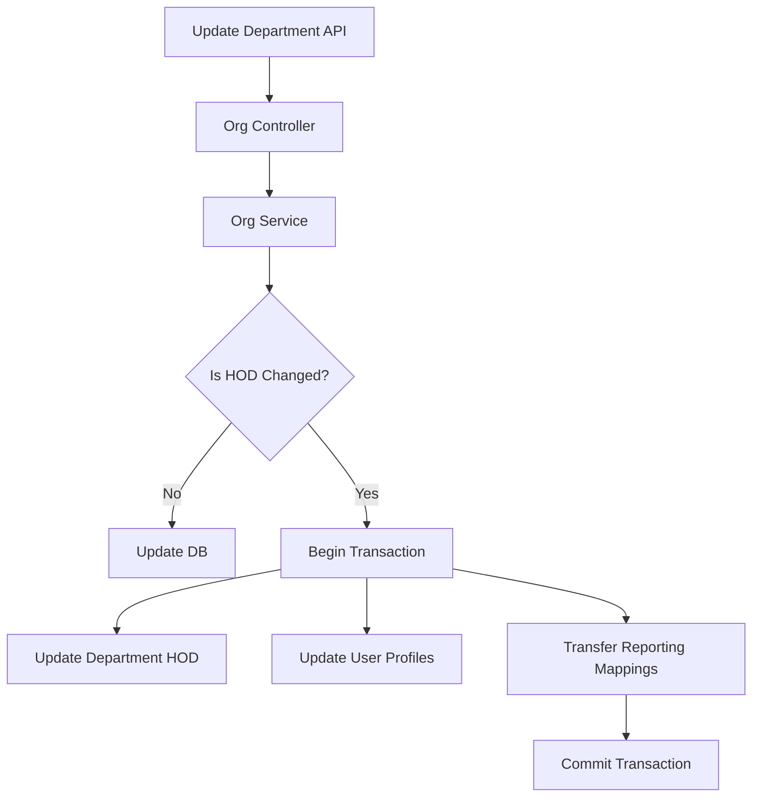

# Organization Structure APIs

**Base URL:** `/api/v1/organizations`  
**Source of Truth:** `organization.routes.js`, `organization.controller.js`, `organization.service.js`, `organization.repository.js`  
**Last Verified:** August 21, 2026

> **Note:** The specific function and ORM method names (e.g., `Organization.create()`) used in the internal execution flows are conceptual/dummy names intended to clearly illustrate the business logic. The internal execution logic, database interactions, transactions, side-effects, and validations described are strictly accurate and verified against the actual codebase.

---

## 1. Create Location

### Business Purpose
Allows an HR administrator to add a new physical or virtual work location for the organization. This acts as the foundational unit for geofencing rules and department assignments later in the workflow.

### Endpoint Contract
- **Method:** `POST`
- **Full Endpoint:** `/api/v1/organizations/locations`
- **Authentication:** Required. Bearer token.
- **Authorization:** `super-admin`, `admin`, `hr`.
- **Content-Type:** `application/json`

**Request Body:**
```json
{
  "name": "Headquarters",
  "address": "123 Main St",
  "city": "Mumbai",
  "state": "Maharashtra",
  "country": "India",
  "zip_code": "400001",
  "timezone": "Asia/Kolkata",
  "is_active": true
}
```

### Validation Rules
- `name`: String. Required. Max 100 characters.
- `address`: String. Optional.
- `city`: String. Optional. Max 100 characters.
- `state`: String. Optional. Max 100 characters.
- `country`: String. Optional. Max 100 characters.
- `zip_code`: String. Optional. Max 20 characters.
- `timezone`: String. Optional. Max 50 characters. Default UTC if not provided.
- `is_active`: Boolean. Optional. Default true.

### Complete Internal Execution Flow
```text
POST /api/v1/organizations/locations
        ↓
AuthMiddleware.authenticate()
        ↓
AuthMiddleware.authorize(['super-admin', 'admin', 'hr'])
        ↓
ValidationMiddleware
        ↓
OrganizationController.handlePostLocation()
        ↓
OrganizationService.createLocation()
        ↓
OrganizationRepository.createLocation()
        ↓
Database Insert (organization_locations)
        ↓
HTTP 201 Created
```

### Database Operations
- **Creates:** `organization_locations` table.
  - **Data:** `{ org_id: req.user.orgId, ...payload }`
- **Transactions**: No transaction required as it's a single table insert.

### Response Structure
**201 Created**
```json
{
  "success": true,
  "message": "Location created successfully",
  "data": {
    "id": "uuid-v4",
    "name": "Headquarters",
    "city": "Mumbai"
  }
}
```

### Frontend Integration
- **When to call**: Upon submitting the "Add New Location" form in Organization Settings.
- **On success**: Refresh the locations list to display the newly added record.

---

## 2. Get Locations

### Purpose
Retrieves all locations for the authenticated user's organization.

### Endpoint
```
GET /api/v1/organizations/locations
```

### Authentication and Authorization
- **Authentication:** Required. Bearer token.
- **Role:** `super-admin`, `admin`, `hr`, `manager`, `employee` (all org roles).

### Internal Working
- Fetches from `organization_locations` where `org_id = user.orgId`.
- Includes inactive locations. Ordered by `name` ASC.

### Response Structure
**200 OK**
```json
{
  "success": true,
  "message": "Locations fetched successfully",
  "data": [
    {
      "id": "uuid-v4",
      "name": "Headquarters",
      "city": "Mumbai",
      "is_active": true
    }
  ]
}
```

---

## 3. Update Location

### Business Purpose
Updates an existing location's details or status (active/inactive). This is essential when physical offices move or close.

### Endpoint Contract
- **Method:** `PUT`
- **Full Endpoint:** `/api/v1/organizations/locations/:id`
- **Authentication:** Required. Bearer token.
- **Authorization:** `super-admin`, `admin`, `hr`.

**Path Parameter:** `id` (UUIDv4).
**Body:** Same fields as Create Location, all optional.

### Complete Internal Execution Flow
```text
PUT /api/v1/organizations/locations/:id
        ↓
AuthMiddleware.authenticate()
        ↓
AuthMiddleware.authorize(['super-admin', 'admin', 'hr'])
        ↓
OrganizationController.handlePutLocation()
        ↓
OrganizationService.updateLocation()
        ↓
OrganizationRepository.updateLocation()
        ↓
Database Update (organization_locations)
        ↓
HTTP 200 OK
```

### Database Operations
- **Updates**: `organization_locations`.
- **Query**: `UPDATE organization_locations SET ... WHERE id = :id AND org_id = :orgId` (Tenant isolation enforced).

### What Can Break If This API Changes?
- **Geofencing**: If a location's lat/long or timezone fields are added/modified here, it directly impacts the Attendance Clock-In geofence calculations.

### Response Structure
**200 OK**
```json
{
  "success": true,
  "message": "Location updated successfully"
}
```

---

## 4. Create Department

### Business Purpose
Allows an HR administrator to create a new department, optionally linking it to a specific location and assigning a Head of Department (HOD). This sets up the logical structure for hierarchical reporting.

### Endpoint Contract
- **Method:** `POST`
- **Full Endpoint:** `/api/v1/organizations/departments`
- **Authentication:** Required. Bearer token.
- **Authorization:** `super-admin`, `admin`, `hr`.
- **Content-Type:** `application/json`

**Request Body:**
```json
{
  "name": "Engineering",
  "description": "Software development team",
  "location_id": "uuid-v4",
  "head_of_department_id": "user-uuid-v4",
  "is_active": true
}
```

### Validation Rules
- `name`: String. Required. Max 100 characters.
- `description`: String. Optional.
- `location_id`: UUIDv4. Optional.
- `head_of_department_id`: UUIDv4. Optional. Must be a user with `hr` or `manager` role.
- `is_active`: Boolean. Optional. Default true.

### Complete Internal Execution Flow
```text
POST /api/v1/organizations/departments
        ↓
AuthMiddleware.authenticate()
        ↓
AuthMiddleware.authorize(['super-admin', 'admin', 'hr'])
        ↓
OrganizationController.handlePostDepartment()
        ↓
OrganizationService.createDepartment()
        ↓
(If HOD provided) checkUserRole(hr or manager)
        ↓
OrganizationRepository.createDepartment()
        ↓
Database Insert (organization_departments)
        ↓
HTTP 201 Created
```

### Every Function Called
**Function**: `createDepartment(orgId, payload)`
- **File**: `src/modules/organization/services/organization.service.js`
- **Purpose**: Creates the department while validating HOD rules.
- **Input**: Org ID, Department Payload.
- **Database interaction**: Reads `user_roles` to verify HOD eligibility. Creates `organization_departments`.
- **Failure behavior**: Throws 400 if an employee is assigned as HOD.

### Database Operations
- **Read:** `user_roles` (to verify the HOD belongs to the org and is a Manager/HR).
- **Create:** `organization_departments`.

### Critical Invariants
- An `employee` role cannot be assigned as `head_of_department_id`.

### Response Structure
**201 Created**
```json
{
  "success": true,
  "message": "Department created successfully",
  "data": {
    "id": "uuid-v4",
    "name": "Engineering"
  }
}
```

---

## 5. Get Departments

### Purpose
Retrieves all departments for the organization. Can be optionally filtered by a specific location.

### Endpoint
```
GET /api/v1/organizations/departments
```

### Authentication and Authorization
- **Authentication:** Required. Bearer token.
- **Role:** `super-admin`, `admin`, `hr`, `manager`, `employee` (all org roles).

### Request Structure
**Query Parameters:**
- `location_id`: UUIDv4. Optional. Filters results to a specific location.

### Internal Working
- Fetches from `organization_departments` joining `organization_locations` (to include location name) and `users`/`user_profiles` (to include HOD name).
- Includes inactive departments. Ordered by `name` ASC.

### Response Structure
**200 OK**
```json
{
  "success": true,
  "message": "Departments fetched successfully",
  "data": [
    {
      "id": "uuid-v4",
      "name": "Engineering",
      "location_id": "loc-uuid",
      "location_name": "Headquarters",
      "head_of_department_id": "user-uuid",
      "head_of_department_name": "Jane Smith",
      "is_active": true
    }
  ]
}
```

---

## 6. Update Department (HOD Transfer)

### Business Purpose
Updates department details. If the `head_of_department_id` is changed, this API invokes the complex atomic **HOD Transfer** process to automatically re-route all subordinate reporting lines to the new HOD, preventing orphaned employees.

### Endpoint Contract
- **Method:** `PUT`
- **Full Endpoint:** `/api/v1/organizations/departments/:id`
- **Authentication:** Required. Bearer token.
- **Authorization:** `super-admin`, `admin`, `hr`.

**Path Parameter:** `id` (UUIDv4).
**Body:**
```json
{
  "name": "Engineering (Updated)",
  "head_of_department_id": "new-manager-uuid-v4"
}
```

### Complete Internal Execution Flow
```text
PUT /api/v1/organizations/departments/:id
        ↓
AuthMiddleware.authenticate()
        ↓
AuthMiddleware.authorize(['super-admin', 'admin', 'hr'])
        ↓
OrganizationController.handlePutDepartment()
        ↓
OrganizationService.updateDepartment()
        ↓
Detect HOD Change?
 ├── NO:
 │    ↓
 │    OrganizationRepository.updateDepartment()
 │    ↓
 │    HTTP 200 OK
 │
 └── YES:
      ↓
      BEGIN TRANSACTION
      ↓
      OrganizationRepository.updateDepartment(new HOD)
      ↓
      UserProfile.update(new HOD, department_head = true)
      ↓
      UserProfile.update(old HOD, department_head = false)
      ↓
      UserReportingMappingRepository.transferReportingLines(old_hod, new_hod, dept_id)
      ↓
      Update all subordinates -> manager mappings
      ↓
      COMMIT TRANSACTION
      ↓
      HTTP 200 OK
```

### Every Function Called
**Function**: `transferReportingLines(orgId, departmentId, oldManagerId, newManagerId, transaction)`
- **File**: `src/modules/organization/repositories/user_reporting_mapping.repository.js`
- **Purpose**: Rewires the tree graph of reporting managers.
- **Why it is called**: To ensure that employees who reported to the old HOD now report to the new HOD, maintaining the approval chain for Attendance and Leave requests.
- **Database interaction**: 
  - Reads active mappings where `manager_id = oldManagerId` and the subordinate belongs to `departmentId`.
  - Updates old mappings (`is_active: false`).
  - Creates new mappings (`is_active: true`, `manager_id: newManagerId`).

### API Dependency Tree


### Database Operations
- **Transactions:** Yes. The HOD transfer is wrapped in a strict transaction (`sequelize.transaction()`). If the mapping transfer fails, the department's HOD does not change.
- **Update:** `organization_departments`, `user_reporting_mappings`, `manager_profiles`/`hr_profiles`/`employee_profiles`.

### Side Effects
- **Reporting Lines:** The entire hierarchy under this department is re-wired instantly. Managers and HR dashboards will immediately reflect the new team structure, and any future attendance approvals will route to the new HOD.

### Response Structure
**200 OK**
```json
{
  "success": true,
  "message": "Department updated successfully"
}
```

### Frontend Integration
- **When to call**: When an HR Admin saves changes in the Department Edit modal.
- **UI UX**: If the HOD is being changed, the frontend should show a warning prompt: "This will transfer all direct reports to the new Head of Department. Continue?"
