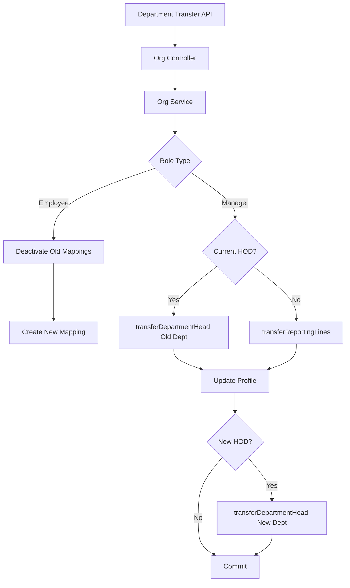

# Organization Employee APIs

**Base URL:** `/api/v1/organizations/employees`  
**Source of Truth:** `organization.routes.js`, `organization.controller.js`, `organization.service.js`  
**Last Verified:** August 21, 2026

> **Note:** The specific function and ORM method names (e.g., `Organization.create()`) used in the internal execution flows are conceptual/dummy names intended to clearly illustrate the business logic. The internal execution logic, database interactions, transactions, side-effects, and validations described are strictly accurate and verified against the actual codebase.

---

## 1. Get Employees List

### Purpose
Fetches a list of employees for the organization. The `purpose` query parameter dictates which fields are returned, optimizing payloads for different frontend components (e.g., HR dashboards vs. Shift Assignment modals). Handles deduplication for users with multiple roles (prioritizing Manager > HR > Employee).

### Endpoint
```
GET /api/v1/organizations/employees
```

### Authentication and Authorization
- **Authentication:** Required. Bearer token.
- **Role:** `super-admin`, `admin`, `hr`, `manager`.

### Request Structure
**Query Parameters:**
- `purpose`: String. Required (for HR/Admin). Determines the shape of the returned data.
  - Allowed values: `all_manager_list`, `all_hr_list`, `all_employee_list`, `shift_assignment`, `emp_report`, `general`.
- `include_inactive`: Boolean. Optional (default false).
- `search`: String. Optional.
- `department_id`: UUID. Optional.

### Internal Working
1. Fetch all `user_roles` for the `orgId`. Includes eager-loaded `user` and all 3 role profiles (employee, manager, hr) plus department and location relations.
2. **Hierarchy-Scoping (New):** For Managers, the results are strictly hierarchy-scoped server-side. Managers get only their direct reports with a roster-safe projection (PAN/UAN/addresses/DOB/personal_email/marital_status stripped), regardless of the `purpose` param they send. HR/admin behavior unchanged.
3. Iterate through records and map them to a unified `employeeData` object.
4. **Deduplication:** Use a Map keyed by `user_id`. If a user has multiple roles (e.g., HR and Employee), the map prioritizes keeping the highest role (`manager` > `hr` > `employee`).
5. **Purpose Filtering/Mapping (HR/Admin only):**
   - `all_*_list`: Filters by the requested role and returns a slimmed-down object (name, email, contact, role, department, designation, avatar, work_location, is_active).
   - `shift_assignment`: Returns only data relevant for scheduling (name, email, role, department, work_mode, work_location).
   - `emp_report`: Returns the fully hydrated object with all 30+ fields (pan, uan, addresses, etc.).

### Response Structure
**200 OK** (Example for `shift_assignment`)
```json
{
  "success": true,
  "message": "Employees fetched successfully",
  "data": [
    {
      "user_id": "uuid-1",
      "name": "Jane Smith",
      "email": "jane@example.com",
      "role": "employee",
      "department": "Engineering",
      "work_mode": "hybrid",
      "work_location": "Headquarters"
    }
  ]
}
```

---

## 2. Get Employee Details (By ID)

### Purpose
Fetches the complete profile and hierarchy data for a specific employee. Includes resolved names for their Reporting Person and Department Head.

### Endpoint
```
GET /api/v1/organizations/employees/:id
```

### Authentication and Authorization
- **Authentication:** Required. Bearer token.
- **Role:** `super-admin`, `admin`, `hr`, `manager`.

### Request Structure
**Path Parameter:** `id` (UUIDv4) - The `user_id`.

### Internal Working
1. **Scope Check:** A strict BOLA/IDOR check runs *before* the existence lookup. An out-of-scope id and a non-existent id both return a uniform `403 Forbidden` for managers to prevent user enumeration. Self and global approvers are always allowed.
2. Fetch `user_roles` linking the requested user and current org.
3. Determine primary role profile.
4. Resolve `reporting_person` ID to actual Name/Email.
5. Resolve `department_id` to fetch the department, then resolve `head_of_department_id` to actual Name/Email.
6. Merge all data into a comprehensive response object.

### Response Structure
**200 OK**
```json
{
  "success": true,
  "message": "Employee fetched successfully",
  "data": {
    "user_id": "uuid-v4",
    "name": "Jane Smith",
    "email": "jane@example.com",
    "role": "employee",
    "department": "Engineering",
    "designation": "Backend Dev",
    "reporting_person_details": {
      "name": "Manager Bob",
      "email": "bob@example.com"
    },
    "department_head_details": {
      "name": "Director Alice",
      "email": "alice@example.com"
    },
    "is_active": true,
    "status": "active"
  }
}
```

---

## 3. Update Employee Status

### Business Purpose
Allows an HR to temporarily suspend or reactivate an employee's access to the organization (e.g., during a leave of absence or disciplinary action).

### Endpoint Contract
- **Method:** `PATCH`
- **Full Endpoint:** `/api/v1/organizations/employees/:id/status`
- **Authentication:** Required. Bearer token.
- **Authorization:** `hr`, `super-admin`, `admin`.

**Path Parameter:** `id` (UUIDv4) - The `user_id`.
**Body:**
```json
{
  "is_active": false
}
```

### Complete Internal Execution Flow
```text
PATCH /api/v1/organizations/employees/:id/status
        ↓
AuthMiddleware.authenticate()
        ↓
AuthMiddleware.authorize(['super-admin', 'admin', 'hr'])
        ↓
OrganizationController.handleUpdateEmployeeStatus()
        ↓
OrganizationService.updateEmployeeStatus()
        ↓
UserRole.update()
        ↓
HTTP 200 OK
```

### Internal Working
Updates `is_active` boolean in the `user_roles` table for this user/org combination.
*Note: This does not affect the global `users.status`, meaning the user can still log into other organizations they belong to.*

### Database Operations
- **Update:** `user_roles` table (`UPDATE user_roles SET is_active = :status WHERE user_id = :id AND org_id = :orgId`).

### Response Structure
**200 OK**
```json
{
  "success": true,
  "message": "Employee status updated successfully"
}
```

---

## 4. Remove (Soft Delete) Employee

### Business Purpose
Removes an employee from the organization permanently (soft delete). Removes their role access and severs active reporting lines. Used when an employee resigns or is terminated.

### Endpoint Contract
- **Method:** `DELETE`
- **Full Endpoint:** `/api/v1/organizations/employees/:id`
- **Authentication:** Required. Bearer token.
- **Authorization:** `hr`, `super-admin`, `admin`.

### Complete Internal Execution Flow
```text
DELETE /api/v1/organizations/employees/:id
        ↓
AuthMiddleware.authenticate()
        ↓
AuthMiddleware.authorize(['super-admin', 'admin', 'hr'])
        ↓
OrganizationController.handleSoftDeleteEmployee()
        ↓
OrganizationService.softDeleteEmployee()
        ↓
UserRole.findOne() (Throws 404 if missing)
        ↓
BEGIN TRANSACTION
        ↓
UserRole.update(is_active: false, deleted_at: NOW)
        ↓
UserReportingMappingRepository.deactivateAllUserMappings()
        ↓
COMMIT TRANSACTION
        ↓
HTTP 200 OK
```

### Internal Working
1. Find user in the org. Throw 404 if missing.
2. Start DB transaction.
3. Update `user_roles` setting `deleted_at = now()` and `is_active = false`.
4. Deactivate all their active reporting mappings (both where they are the subordinate AND where they are the manager). Reason: "User Removed from Organization".
5. Note: If this user is an HOD, they must be manually replaced on the Department before being removed, or the department will be left headless.
6. Commit transaction.

### Every Function Called
**Function**: `deactivateAllUserMappings(userId, transaction)`
- **File**: `src/modules/organization/repositories/user_reporting_mapping.repository.js`
- **Purpose**: Cleans up the tree graph to prevent dead branches.
- **Why it is called**: An employee cannot continue to report to a manager if they are fired, and a fired manager cannot have active subordinates.
- **Database interaction**: `UPDATE user_reporting_mappings SET is_active = false WHERE manager_id = :id OR subordinate_id = :id`.

### Response Structure
**200 OK**
```json
{
  "success": true,
  "message": "Employee successfully removed from organization"
}
```

---

## 5. Department Transfer

### Business Purpose
A highly complex, atomic operation that handles moving a user between departments, modifying their reporting lines, and managing Head of Department (HOD) handovers.

### Endpoint Contract
- **Method:** `PUT`
- **Full Endpoint:** `/api/v1/organizations/users/:id/department-transfer`
- **Authentication:** Required. Bearer token.
- **Authorization:** `hr`, `super-admin`, `admin`.

**Request Body:**
```json
{
  "role": "employee", 
  "new_department_id": "uuid-v4", 
  "new_manager_id": "manager-uuid", 
  "is_current_hod": false,
  "is_new_hod": false,
  "replacement_hod_id": null,
  "old_dept_fallback_manager_id": null
}
```

### Validation Rules
- `role`: Enum (employee, hr, manager). Required.
- `new_department_id`: UUIDv4. Optional (null implies removing them from any department).
- **If role = employee:**
  - If changing/adding department: `new_manager_id` is required UNLESS the `new_department_id` has an active HOD, in which case it auto-defaults to that HOD.
  - If removing department: `new_manager_id` is explicitly required.
- **If role = manager/hr (and they are the CURRENT HOD):**
  - `is_current_hod` must be true.
  - `replacement_hod_id` is strictly REQUIRED (cannot leave the old department headless).
- **If role = manager/hr (and they are NOT the current HOD):**
  - `old_dept_fallback_manager_id` is required (to hand over their existing subordinates). If not provided, it falls back to the old department's HOD.

### Complete Internal Execution Flow
```text
PUT /users/:id/department-transfer
        ↓
OrganizationController.handlePutDepartmentTransfer()
        ↓
OrganizationService.transferDepartment()
        ↓
BEGIN TRANSACTION
        ↓
Lock Profile (EmployeeProfile | ManagerProfile)
        ↓
Is transferring an Employee?
 ├── YES:
 │    ↓
 │    Resolve newReportingPerson
 │    ↓
 │    Profile.update(department_id, reporting_person)
 │    ↓
 │    Deactivate active mappings
 │    ↓
 │    UserReportingMapping.create(new mapping)
 │
 └── NO (Transferring Manager/HR):
      ↓
      Is is_current_hod == true?
       ├── YES: transferDepartmentHead(old_dept, replacement_hod)
       └── NO: transferReportingLines(old_manager, fallback_manager)
      ↓
      Profile.update(new department_id)
      ↓
      Is is_new_hod == true?
       ├── YES: transferDepartmentHead(new_dept, transferring_user)
       └── NO: (No action)
        ↓
COMMIT TRANSACTION
        ↓
HTTP 200 OK
```

### Internal Working
1. **Fetch Profile:** Lock and load the specific role profile (EmployeeProfile, ManagerProfile, or HrProfile).
2. **Path A: Transferring an Employee**
   - Determine `newReportingPerson` (from payload or auto-fallback to new dept's HOD).
   - Update profile `department_id` and `reporting_person`.
   - Call `userReportingMappingRepository.deactivateActiveMappingsForEmployee`.
   - Create a NEW `user_reporting_mappings` record pointing the employee to the `newReportingPerson`.
3. **Path B: Transferring a Manager/HR**
   - **Handling the OLD Department:**
     - If `is_current_hod` = true: Invoke `transferDepartmentHead` to atomically swap the `replacement_hod_id` into the old department and re-wire all subordinates to the replacement.
     - If `is_current_hod` = false: Invoke `transferReportingLines` to re-wire this specific manager's current subordinates to the `old_dept_fallback_manager_id`.
   - **Updating Profile:** Change `department_id` on their profile.
   - **Handling the NEW Department:**
     - If `is_new_hod` = true: Invoke `transferDepartmentHead` to formally make them the HOD of the new department, auto-rewiring all employees in that department to report to them.
4. **Commit:** Commit the PostgreSQL transaction.

### Services Used by the API
- **OrganizationService**: Contains the complex transfer logic.
- **UserReportingMappingRepository**: Handles the low-level SQL to swap `manager_id` constraints atomically.

### API Dependency Tree


### Database Operations
- **Transactions:** Yes, fully wrapped. Critical invariant.

### Concurrency and Race Conditions
- **Row Locking**: The profile row is locked for update (`transaction.LOCK.UPDATE`) at the start of the process to prevent two concurrent admins from transferring the same employee simultaneously.

### Side Effects
- This API fundamentally alters the reporting hierarchy. It can update dozens of rows in the `user_reporting_mappings` table simultaneously to ensure the organizational chart remains unbroken.

### Response Structure
**200 OK**
```json
{
  "success": true,
  "message": "Department transfer completed successfully"
}
```

### Frontend Integration
- **When to Call:** When an HR submits the "Transfer Department" modal.
- **Required Logic:** The frontend UI must be dynamic. If the selected user is an Employee, show a "New Manager" dropdown. If the selected user is a Manager who is currently an HOD, force the HR to select a "Replacement HOD" before enabling the Submit button.

---

## 6. Update Employee Profile (By Manager)

### Business Purpose
Allows managers to edit a direct report's whitelisted personal fields.

### Endpoint Contract
- **Method:** `PATCH`
- **Full Endpoint:** `/api/v1/organizations/employees/:id`
- **Authentication:** Required. Bearer token.
- **Authorization:** `super-admin`, `admin`, `hr`, `manager`.

### Request Structure
**Path Parameter:** `id` (UUIDv4) - The `user_id` of the direct report.
**Body:** Allowed personal fields (e.g., name, phone_number, avatar_url).

### Internal Working
1. Cross-team id results in a 403 Forbidden.
2. Self-edit via this endpoint results in a 400 Bad Request (users must use `/me`).
3. Role, department, designation, employee_code, and leave-gate demographics are not editable via this route.
4. Writes to `user_profiles` and the specific role profile atomically via a shared `_writeProfileFields` helper (also reused by `updateMyProfile`).

---

## 7. Get My Profile

### Business Purpose
Fetches the logged-in user's own full profile. Scoped to `actorUser.id` (no IDOR) and reuses `getEmployeeById`.

### Endpoint Contract
- **Method:** `GET`
- **Full Endpoint:** `/api/v1/organizations/me`
- **Authentication:** Required. Bearer token.
- **Authorization:** All org roles.

### Request Structure
**Body:** None.

---

## 8. Update My Profile

### Business Purpose
Updates the logged-in user's own personal fields. Implements a strict whitelist, rejecting edits to `department`, `designation`, `gender`, `marital_status`, `employee_code`, and `pan_number` (unknown=false). Updates both user and profile tables in one transaction.

### Endpoint Contract
- **Method:** `PATCH`
- **Full Endpoint:** `/api/v1/organizations/me`
- **Authentication:** Required. Bearer token.
- **Authorization:** All org roles.

### Request Structure
**Body:** Allowed personal fields (e.g., name, phone, etc.).

---

## 9. Get Employee Directory

### Business Purpose
Fetches a public-safe employee directory. Deliberately omits sensitive fields (addresses, PAN/UAN, DOB, personal_email, marital_status) and only returns name, email, avatar, role, department, designation, and work_location.

### Endpoint Contract
- **Method:** `GET`
- **Full Endpoint:** `/api/v1/organizations/directory`
- **Authentication:** Required. Bearer token.
- **Authorization:** All org roles.

### Request Structure
**Body:** None.

