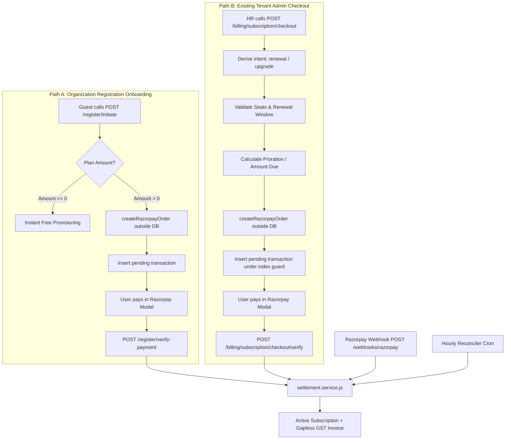

# HRMS Platform Money & Subscription Handling Architecture

This document provides a comprehensive architectural and operational blueprint of **how the HRMS platform manages all money-related operations, financial invariants, subscription lifecycles, payment gateway integrations, and statutory accounting**.

It serves as the definitive reference for engineering, operations, and technical leadership on how money enters, transitions through, and is accounted for across the system.

---

## 1. Core Financial Principles & Money Philosophy

Financial processing in a multi-tenant SaaS application requires zero tolerance for rounding errors, race conditions, or unverified claims. The HRMS platform enforces five foundational financial principles:

```
┌──────────────────────────────────────────────────────────────────────────────────┐
│                           THE FIVE FINANCIAL INVARIANTS                          │
├────────────────────────────────┬─────────────────────────────────────────────────┤
│ 1. Zero Client Trust           │ Money amounts, plan prices, and intents are     │
│                                │ never accepted from client requests.            │
├────────────────────────────────┼─────────────────────────────────────────────────┤
│ 2. Single Settlement Chokepoint│ Exactly one service module in the entire system │
│                                │ is permitted to settle payments and grant plans.│
├────────────────────────────────┼─────────────────────────────────────────────────┤
│ 3. Strict Integer Paise Math   │ No currency arithmetic uses JS floating-point   │
│                                │ numbers. Integer paise is used exclusively.     │
├────────────────────────────────┼─────────────────────────────────────────────────┤
│ 4. Gapless Statutory Invoicing │ Indian GST compliance requires sequential,      │
│                                │ gapless invoice serial numbers per FY.          │
├────────────────────────────────┼─────────────────────────────────────────────────┤
│ 5. Immutable Plan Snapshots    │ Historical subscriptions freeze plan terms at   │
│                                │ checkout, isolating past payments from edits.   │
└────────────────────────────────┴─────────────────────────────────────────────────┘
```

---

## 2. Currency Representation & Precision Math (`money.utils.js`)

JavaScript's standard `Number` type utilizes IEEE 754 floating-point arithmetic, which suffers from precision artifacts (e.g. `0.1 + 0.2 === 0.30000000000000004`). In commercial billing, even a single sub-paise drift will cause gateway signature mismatches and reconciliation failures.

### The Conversion Engine
All monetary parsing, formatting, and cross-checking are centralized in `src/modules/billing/utils/money.utils.js`:
* **PostgreSQL Storage:** Money columns (`transactions.amount`, `subscription_plans.amount`) use `DECIMAL(10,2)` or `DECIMAL(12,2)`. When returned by Sequelize, they arrive as exact decimal strings (e.g. `'14999.00'`).
* **Paise Parsing (`toPaise`):** Regex-based string parser converts decimal strings into exact integer paise without floating-point math:
  ```js
  // '14999.50' -> whole=14999, frac='50' -> (14999 * 100) + 50 -> 1499950 paise
  const paise = Number(whole) * 100 + Number(frac);
  ```
  Strictly rejects strings with $>2$ decimal places, `NaN`, or `Infinity`.
* **Paise Formatting (`fromPaise`):** Formats integer paise back to a 2-decimal place string (`1499950 -> '14999.50'`).
* **Gateway Equality Assertion (`assertGatewayAmount`):**
  Asserts that the internal database amount in paise matches the Razorpay reported amount in paise exactly:
  $$\text{toPaise}(\text{tx.amount}) \equiv \text{payment.amount}$$
  Any discrepancy (even 1 paise) halts activation and triggers `AMOUNT_MISMATCH`.

---

## 3. The Plan Purchase Lifecycles

The platform supports two distinct purchase pathways that converge on the same settlement engine:



### Pathway A: Initial Organization Registration Purchase
* **Initiation (`POST /organizations/register/initiate`):**
  1. Resolves plan from database (`subscriptionPlanRepository.findActiveByCode`).
  2. If free tier: immediately creates organization, assigns `hr` role, creates creator profile, materializes perpetual subscription (`current_period_end = null`), and returns HR tokens.
  3. If paid tier: calls `createRazorpayOrder()` outside the DB transaction. Then opens a DB transaction to create an `inactive` organization and a `pending` transaction row with `intent = 'initial'`.
* **Verification (`POST /organizations/register/verify-payment`):**
  1. Authenticates token and verifies tenant correlation (`tx.org_id === org_id`).
  2. Verifies cryptographic signature using `crypto.timingSafeEqual`.
  3. Calls `settlementService.settle()` with an `onProvision` callback that activates the organization and promotes the guest user to HR Administrator.

### Pathway B: Existing Tenant Admin Checkout
* **Pre-Check (`GET /billing/subscription/preview-change`):**
  Evaluates upgrade proration, unused credits, seat limits, and renewal windows before opening the checkout modal.
* **Order Creation (`POST /billing/subscription/checkout`):**
  1. Enforces Redis hourly rate limit (10 checkouts/hour per org).
  2. Evaluates `Idempotency-Key` header against Redis cache to prevent duplicate requests.
  3. Derives intent server-side (`initial`, `reactivation`, `renewal`, `upgrade`).
  4. Mints Razorpay order outside DB transaction.
  5. Inserts `pending` transaction row inside DB transaction. The database partial unique index `transactions_one_pending_subscription_uidx` prevents concurrent duplicate checkouts.
* **Verification (`POST /billing/subscription/checkout/verify`):**
  1. Validates Razorpay signature timing-safely.
  2. Dispatches to `settlementService.settle()`.

---

## 4. The Single Settlement Chokepoint (`settlement.service.js`)

To guarantee zero race conditions between interactive user callbacks, asynchronous webhooks, and background reconciliation, `settlement.service.js` is the **only code in the system** permitted to move a transaction to `success` and activate a subscription.

### The 14-Step Atomic Settlement Sequence
```text
1. Locate Transaction by (provider, provider_order_id)
   └─ Assert tenant ownership (req.user.orgId === tx.org_id)
2. Signature Verification (Client Callback path only)
   └─ crypto.timingSafeEqual over HMAC-SHA256(order_id + '|' + payment_id)
3. Mandatory Gateway Out-of-Band Cross-Check (ALL paths)
   └─ fetchPayment(paymentId) via HTTPS
   └─ Assert order_id match, captured status, exact currency, and exact paise equality
4. Open Database Transaction & Lock Transaction Row
   └─ SELECT ... FROM transactions WHERE id = :id FOR UPDATE
5. Idempotent Re-entry Check
   └─ If status === 'success', commit and return { already_settled: true }
   └─ If status not in ('pending'), throw 409 INVALID_PAYMENT_STATE
6. Compare-And-Set Payment Status
   └─ UPDATE transactions SET status = 'success', settled_at = now() WHERE id = :id AND status = 'pending'
7. Lock Live Subscription Row
   └─ SELECT ... FROM org_subscriptions WHERE org_id = :orgId AND status IN ('active','in_grace') FOR UPDATE
8. Period Calculation from Intent
   └─ Initial / Reactivation: starts now
   └─ Renewal: starts at renewalAnchor (current_period_end if not yet expired)
   └─ Upgrade: starts now; end date REMAINS current_period_end (upgrade never extends period)
9. Close Predecessor & Insert New Subscription
   └─ Supersede old subscription: status = 'canceled', ended_at = now()
   └─ Insert new subscription row carrying frozen plan_snapshot and calculated dates
10. On-Provisioning Callback
    └─ For registration: activate organization, assign HR role, create HR profile
11. Link Subscription to Transaction
    └─ UPDATE transactions SET subscription_id = :newSubId
12. Allocate Gapless GST Invoice Number LAST
    └─ SELECT ... FROM billing_invoice_sequences WHERE scope = :fyScope FOR UPDATE
    └─ Allocate next serial, format INV-YYYY-YY-XXXXXX, freeze invoice_snapshot into transaction
13. Write Ledger Audit Events
    └─ Insert payment.succeeded and subscription.activated|renewed|upgraded into subscription_events
14. COMMIT Database Transaction
    └─ Post-commit: emit background emails, structured log emission
```

---

## 5. Plan Renewals & Period Anchoring

### The Renewal Window
Administrators can renew an active subscription within **15 days** before expiration (`RENEWAL_WINDOW_DAYS = 15`). Attempting to renew earlier is rejected with HTTP `409 Conflict` (`RENEWAL_TOO_EARLY`).

### The Zero-Lost-Days Anchor Algorithm
A major customer complaint in naive billing systems is losing purchased days when renewing early. The HRMS prevents this through `renewalAnchor()` (`src/modules/billing/utils/billing_period.utils.js:45`):
```js
function renewalAnchor(currentPeriodEndISO, nowISO) {
  if (!currentPeriodEndISO) return dayjs.utc(nowISO).toISOString();
  const end = dayjs.utc(currentPeriodEndISO);
  const now = dayjs.utc(nowISO);
  return now.isBefore(end) ? end.toISOString() : now.toISOString();
}
```
* **Early Renewal:** If an organization renews 10 days before expiry, the new period start date is anchored to `current_period_end`. The new billing term begins when the old one naturally finishes. Zero days are lost.
* **Late Renewal (During Grace or Expired):** If renewed after the expiration date, the new period begins immediately at `now`.

---

## 6. Plan Upgrades & Proration Engine (`proration.utils.js`)

When an organization outgrows its plan (e.g. requires more employee seats or unlocks the Payroll/Documents modules), it can upgrade mid-cycle.

### Proration Principles (D-B16, §7.3)
1. **Day-Granular:** Proration uses day boundaries (`ceilDays` of the hourly difference).
2. **Period End Invariant:** An upgrade **never extends the subscription end date**. The customer pays to use a higher tier for the remainder of their already purchased term.
3. **Proration Formula:**
   $$\text{period\_days} = \max(1, \text{ceilDays}(\text{period\_start}, \text{period\_end}))$$
   $$\text{remaining\_days} = \max(0, \text{ceilDays}(\text{now}, \text{period\_end}))$$
   $$\text{unused\_credit} = \text{round}\left(\frac{\text{current\_plan\_paise} \times \text{remaining\_days}}{\text{period\_days}}\right)$$
   $$\text{target\_prorated} = \text{round}\left(\frac{\text{target\_plan\_paise} \times \text{remaining\_days}}{\text{period\_days}}\right)$$
   $$\text{amount\_due} = \max(\text{target\_prorated} - \text{unused\_credit}, 0)$$
4. **Gateway Minimum Floor:** Razorpay rejects orders below ₹1.00 (100 paise). If `0 < amount_due < ₹1.00`, the amount is automatically rounded up to **₹1.00** (`applyMinimum` in `proration.utils.js:87`).
5. **Zero-Amount Upgrades:** If `amount_due === 0` (e.g. upgrading from a free tier with 0 remaining days), the change is applied immediately without creating a gateway order or charging the customer.

---

## 7. Plan Downgrades & Scheduled Changes

Direct immediate downgrades via checkout are strictly forbidden (`409 USE_SCHEDULED_DOWNGRADE`).

### Why Downgrades are Scheduled (D-B16)
1. **No Payment Mandate:** The platform does not store card details or auto-debit mandates. We cannot automatically charge or refund mid-period.
2. **Preventing Premature Loss of Paid Features:** Customers have already paid for their higher tier through the end of the term.
3. **The Scheduled Downgrade Workflow (`POST /billing/subscription/schedule-change`):**
   * **Pre-Flight Seat Check:** Evaluates current organizational headcount against the cheaper plan's limits. If current headcount exceeds the target limits, the downgrade is refused immediately (`409 SEAT_LIMIT_EXCEEDED`).
   * **Queuing:** Sets `scheduled_plan_id` on the active subscription.
   * **Period-End Application:** When the daily lifecycle cron runs at period end:
     - If the target plan is free ($0), the downgrade is applied automatically without payment.
     - If the target plan is paid, it becomes the pre-selected renewal target in the billing dashboard.

---

## 8. Cancellations & Voluntary Termination

The platform supports two cancellation modes via `POST /api/v1/billing/subscription/cancel`:

| Cancellation Mode | Database Updates | Entitlement Impact | Reversibility | Refund Policy |
| :--- | :--- | :--- | :--- | :--- |
| **Period-End (`'period_end'`)** *(Default)* | `cancel_at_period_end = true`<br>`cancel_effective = 'period_end'`<br>`canceled_at = now()` | Status stays `active`. Features remain accessible through `current_period_end`. | Fully reversible via `POST /cancel/undo` before period end. | Normal billing cycle finishes; no refund applicable. |
| **Immediate (`'immediate'`)** *(Requires `confirm: true`)* | `status = 'canceled'`<br>`ended_at = now()`<br>`cancel_effective = 'immediate'` | Entitlements terminate immediately. Status flips to `canceled`. | Irreversible. Must purchase a new plan to reactivate. | **No automated refund.** Policy disclaimer emitted in API response. |

* **Free Plan Guard:** A free perpetual plan cannot be cancelled (`409 CANNOT_CANCEL_FREE_PLAN`) because there is no recurring billing to stop, and cancelling would lock the tenant out permanently.

---

## 9. Statutory GST Tax Invoicing (`billing_invoice_sequences`)

Under Indian GST statutory regulations, commercial SaaS tax invoices must carry consecutive, gapless serial numbers per financial year.

### The Gapless Invoicing Mechanism
* **Why Postgres Sequences are Not Used:** Standard database sequences increment even if an enclosing transaction rolls back, leaving permanent gaps that violate tax audits.
* **The FY Sequence Table:** The system uses table `billing_invoice_sequences`, keyed by scope:
  - Invoices: `'INV-2026-27'` (April 1 to March 31).
  - Credit Notes: `'CN-2026-27'`.
* **Lock Hierarchy:** Invoice number allocation occurs inside the settlement transaction under pessimistic row locking (`SELECT ... FOR UPDATE` in `invoiceSequenceRepository.allocate`). The lock is acquired **last in the transaction**, held for only microseconds before commit, ensuring high throughput without gaps.
* **The Frozen Snapshot (`invoice_snapshot`):**
  The transaction freezes the complete tax invoice structure:
  - Seller Block: Corporate name, address, GSTIN (`06AAACH1234F1Z5`), PAN.
  - Buyer Block: Customer legal name, address, GSTIN, PAN as of settlement day.
  - Line Items: Service Accounting Code (HSN/SAC `998314`), description, unit price.
  - Tax Breakup: Taxable subtotal, CGST, SGST, IGST.
  - Credit Notes: Array of linked credit note numbers and refund timestamps.

---

## 10. Refund Ingestion & Credit Notes (`refund.service.js`)

In accordance with strict role plane separation, the tenant plane does not host a refund initiation API (refunds are seller actions).

### The Ingestion Pipeline (D-B14)
1. **Initiation:** Finance administrators issue full or partial refunds directly through the Razorpay Dashboard.
2. **Webhook Reception:** Razorpay delivers `refund.created` and `refund.processed` to `/webhooks/razorpay`.
3. **Credit Note Allocation:** The moment a refund is processed:
   * A gapless credit note serial is allocated from `billing_invoice_sequences` (e.g. `CN-2026-27-000001`).
   * A row is inserted into `subscription_refunds`.
   * `transactions.refunded_amount` is incremented under row lock.
   * Payment status walks: `success -> partially_refunded -> refunded`.
4. **Subscription Invariant:** **A refund never cancels an active subscription.** Subscription status remains completely untouched unless explicitly cancelled by an administrator.

---

## 11. Concurrency Controls & Anti-Double-Billing Invariants

```
┌─────────────────────────────────────────────────────────────────────────────────┐
│                           DATABASE CONCURRENCY SHIELDS                          │
├──────────────────────────────────────────┬──────────────────────────────────────┤
│ transactions_one_pending_subscription_uidx│ Exactly one pending checkout allowed │
│                                          │ per organization at any time.        │
├──────────────────────────────────────────┼──────────────────────────────────────┤
│ org_subscriptions_one_live_uidx          │ Exactly one live subscription        │
│                                          │ (active, in_grace) per organization. │
├──────────────────────────────────────────┼──────────────────────────────────────┤
│ transactions_provider_order_id_uidx      │ Uniqueness on Razorpay order ID.     │
├──────────────────────────────────────────┼──────────────────────────────────────┤
│ transactions_provider_payment_id_uidx    │ Uniqueness on Razorpay payment ID.   │
├──────────────────────────────────────────┼──────────────────────────────────────┤
│ transactions_idem_uidx                   │ Uniqueness on (org_id, idempotency)  │
└──────────────────────────────────────────┴──────────────────────────────────────┘
```

### Total Lock Hierarchy
To eliminate deadlock hazards across concurrent requests, database locks are acquired top-down:
$$\text{transactions (FOR UPDATE)} \longrightarrow \text{org\_subscriptions (FOR UPDATE)} \longrightarrow \text{organizations (FOR UPDATE)} \longrightarrow \text{billing\_invoice\_sequences (FOR UPDATE)}$$

---

## 12. Automated Background Sentries & Cron Automation

Three automated background crons safeguard financial integrity:

### 1. Webhook Drain Worker (`billing_webhook_drain.cron.js`, Every 5 Minutes)
* Scans `billing_webhook_events` for rows in `received` or retryable `failed` status.
* Atomically claims rows using compare-and-set (`attempts` counter incremented).
* Dispatches `payment.captured` to `settlementService.settle({ source: 'webhook' })`.
* Dispatches refund events to `refundService`.
* Handles backoff: `min(2^attempts, 60)` minutes, capped at 8 attempts.

### 2. Reconciliation Worker (`billing_reconciliation.cron.js`, Hourly at :10)
* Rescues customers who paid and closed the browser tab.
* Scans `transactions` for rows stuck in `pending` older than 20 minutes (`PENDING_GRACE_MINUTES = 20`).
* Probes Razorpay API (`fetchOrderPayments`):
  - If a payment was `captured`, triggers automated settlement.
  - If all payments `failed`, transitions transaction to `failed`.
  - If no payment was made and order is older than 24 hours (`ORDER_TTL_HOURS = 24`), marks transaction `cancelled` to free the pending index.
* **Gateway Outage Guard:** If Razorpay is unreachable (503), the reconciler leaves the transaction untouched and retries next hour.

### 3. Daily Lifecycle Sweeper (`subscription_lifecycle.cron.js`, Daily at 00:20 IST)
Executes five bounded, idempotent passes:
* **Pass 5 (Runs First):** Applies scheduled **free** downgrades whose period ended.
* **Pass 1:** Moves `active` subscriptions past period end to `in_grace` (if grace days remain) or `expired`.
* **Pass 2:** Moves `in_grace` subscriptions past grace end to `expired`.
* **Pass 3:** Matures scheduled period-end cancellations to `canceled`.
* **Pass 4:** Generates expiry warning notices based on configured lead days (`[7, 1]`), deduped on `subscription_events.dedupe_key`.
* **Advisory Locking:** Protected by PostgreSQL session advisory lock `pg_try_advisory_lock(hashtext('billing:lifecycle'))` to prevent multi-instance cron collision.
