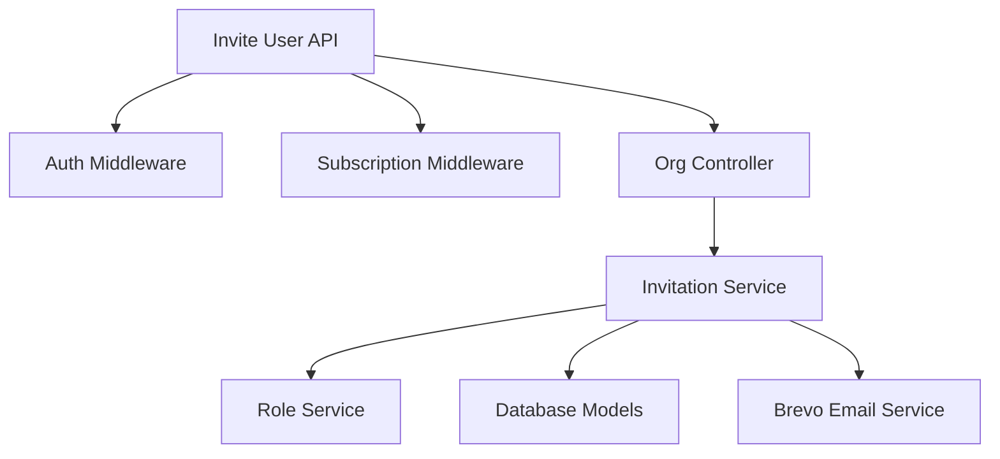

# Organization Invitation APIs

**Base URL:** `/api/v1/organizations/invitations`  
**Source of Truth:** `invitation.routes.js`, `invitation.controller.js`, `invitation.service.js`  
**Last Verified:** September 24, 2026

> **Note:** The specific function and ORM method names (e.g., `Organization.create()`) used in the internal execution flows are conceptual/dummy names intended to clearly illustrate the business logic. The internal execution logic, database interactions, transactions, side-effects, and validations described are strictly accurate and verified against the actual codebase.

---

## 1. Invite User

### Business Purpose
Allows an HR or Manager to invite a new or existing user into their organization. This API handles complex logic including: checking subscription limits, checking hierarchical role priorities, establishing reporting lines, assigning department/location, and designating Heads of Departments (HOD). It dispatches an email with a secure token link.

### Endpoint Contract
- **Method:** `POST`
- **Full Endpoint:** `/api/v1/organizations/users/invite`
- **Authentication:** Required. Bearer token.
- **Authorization:** `hr`, `manager`.
- **Policy:** The inviter cannot invite someone to a role that has a higher priority than their own (e.g., a Manager cannot invite an HR). Enforced via `checkInvitationPolicy`.
- **Content-Type:** `application/json`

**Request Body:**
```json
{
  "email": "john.doe@example.com",
  "role": "employee",
  "name": "John Doe",
  "department_id": "uuid-v4",
  "make_hod": false,
  "reporting_person": "manager-uuid-v4",
  "location_id": "uuid-v4",
  "designation": "Software Engineer",
  "emp_id": "EMP-001",
  "work_mode": "hybrid",
  "contact": "+1234567890"
}
```

### Validation Rules
- `email`: String. Required. Valid email format.
- `role`: String. Required. Enum: `employee`, `manager`, `hr`, `admin`, `worker`. (The invitation policy further restricts which of these the caller may actually invite — this enum only rejects garbage at the edge.)
- `name`: String. Optional.
- `department_id`: UUIDv4. Optional.
- `make_hod`: Boolean. Optional. Default `false`. If true, `role` cannot be `employee` (`400 INVALID_HOD_ROLE`) and `department_id` is required (`400 MISSING_DEPARTMENT_FOR_HOD`). Stored as `department_head` on the invitee's role profile; the headship itself is executed when they **accept** (see §"Accept Invitation"), never at invite time.
  - **Fixed 2026-10-02:** `make_hod` now works for `role: hr`. `hr_profiles` had no `department_head` column (migration 00068 adds it), so Sequelize silently dropped the flag and the invitee never became the department's head on accept. HR invites sent **before** this fix left no trace of the intent — appoint the head manually with `PUT /organizations/departments/:id`.
  - The flag is written **explicitly** on every manager/HR invite (`true` or `false`). Re-inviting someone whose earlier `make_hod` invite lapsed therefore no longer leaves a stale `true` that would hand them headship the moment they accept a later, head-less invitation.
- `reporting_person`: UUIDv4. Optional. Must point to a user with `hr` or `manager` role in the org.
- `location_id`: UUIDv4. Optional.
- `work_mode`: String. Enum: `on-site`, `remote`, `hybrid`, `field`. Optional.
- Also accepted, all optional:
  - **Identity:** `emp_id` (≤100), `contact` (≤50), `city` (≤150), `designation` (≤150).
  - **Statutory:** `pan_number` (≤50), `uan_number` (≤50).
  - **Personal:** `blood_group` (≤20), `marital_status` (≤50), `personal_email` (email, ≤150), `dob` (ISO date).
  - **Address:** `current_address`, `permanent_address`, `state` (≤100), `pincode` (≤20).
  - **Employment:** `job_status` (`probation` · `confirmed` · `notice_period` · `terminated` · `trainee` · `contract` · `temporary`), `employment_type` (`full_time` · `part_time` · `contract` · `intern`), `joining_date` (ISO date).
- `gender`: String. Optional. Enum: `male`, `female`, `other`. **Stored on the invitee's role profile** (`employee_profiles` / `manager_profiles` / `hr_profiles`, with no column default). `GET /organizations/employees` (#8) and `GET /organizations/employees/:id` (#9) return it from that same row. Self-service and team profile edits cannot change it, because gender drives leave eligibility. HR corrects it with `PATCH /organizations/employees/:id/hr-fields` (HR only, reason required). The same endpoint can fill a `joining_date` that was not set at invite.
- **One role profile per invitee (2026-10-02).** Re-inviting a non-member under a different role, for example after an earlier invite expired, removes the live profile the earlier invite left in another role table before writing the new one. Previously both rows survived, and readers that probe the tables in a fixed order showed the stale row's gender.

> **Manager callers are restricted to identity fields.** Only the HR plane (`hr` / `admin` /
> `super-admin`) may set job/org/statutory/demographic fields at invite time: `emp_id`, `location_id`,
> `department_id`, `designation`, `pan_number`, `uan_number`, `job_status`, `employment_type`,
> `work_mode`, `marital_status`, `joining_date`, `make_hod`, `dob`, `gender`. If a `manager` supplies any of them the
> request is rejected with `403 FORBIDDEN_INVITE_FIELD`. A manager's invitee always reports to that
> manager — `reporting_person` is forced to the manager's own id, and supplying a different value
> returns `403 FORBIDDEN_REPORTING_PERSON`. Managers may still set identity/personal fields (`name`,
> `contact`, `city`, `blood_group`, `current_address`, `permanent_address`, `state`,
> `pincode`, `personal_email`).

### Complete Internal Execution Flow
```text
POST /api/v1/organizations/users/invite
        ↓
AuthMiddleware.authenticate()
        ↓
AuthMiddleware.authorize(['super-admin', 'admin', 'hr', 'manager'])
        ↓
SubscriptionMiddleware.requireSubscription() (Limits check)
        ↓
OrganizationController.handlePostInviteUser()
        ↓
InvitationService.inviteUser()
        ↓
RoleService.checkInvitationPolicy()
        ↓
User.findOne(email)
        ↓
If New: User.create(pending_verification)
If Existing: Verify no duplicate membership / pending invite
        ↓
UserProfile.upsert() (Split name)
        ↓
EmployeeProfile / ManagerProfile / HrProfile .upsert()
        ↓
Department/Location Validation (If HOD/Manager logic applies)
        ↓
UserReportingMapping.create() (Pending status)
        ↓
Invitation.create() (Generate Hex Token)
        ↓
Brevo (External Email API)
        ↓
Response Formatter
        ↓
HTTP 200 OK
```

### Every Function Called

**Function**: `inviteUser(inviterId, orgId, payload)`
- **File**: `src/modules/organization/services/invitation.service.js`
- **Purpose**: Core orchestration of creating a user profile, establishing hierarchy, and sending the invite email.
- **Why it is called**: Abstracts heavy business logic from the controller.
- **Input**: Inviter's ID, Organization ID, Payload (email, role, department, etc.).
- **Output**: `{ target_user_id: uuid }`
- **Database interaction**: Reads `users`, `roles`. Creates/Upserts `users`, `user_profiles`, `hr/manager/employee_profiles`, `user_reporting_mappings`, `invitations`.
- **Side effects**: Dispatches an email via Brevo.
- **Failure behavior**: Throws `AppError` if role priority is violated or user is already in the org.

**Function**: `checkInvitationPolicy(inviterRoleId, targetRoleKey)`
- **File**: `src/modules/organization/services/role.service.js`
- **Purpose**: Prevents privilege escalation.
- **Why it is called**: A manager should not be able to invite someone as an HR.
- **Input**: Inviter's Role UUID, Target Role String (e.g. 'hr').
- **Failure behavior**: Throws `403 FORBIDDEN_PRIORITY`.

### Services Used by the API
- **InvitationService**: Handles the invitation workflow.
- **RoleService**: Enforces role hierarchy rules.
- **BrevoService**: Sends the email payload.

### API Dependency Tree


### Database Operations
- **Read**: `roles`, `users` (by email), `user_roles` (check duplicate), `invitations` (check active), `organizations`, `organization_departments`.
- **Create/Upsert**:
  - `users` (If new, `status = pending_verification`).
  - `user_profiles` (`first_name`, `last_name`).
  - Role-specific profiles (`employee_profiles`, etc.).
  - `user_reporting_mappings` (Creates relationship with `active_from: null`).
  - `invitations` (Generates token).
  - `organization_invitations` (the durable ledger row backing the list endpoint — see §6). Written inside the same transaction, just before commit: an existing **open** row for this user is refreshed in place (`send_count + 1`, window restarted), otherwise a new row is inserted. A unique-violation on the partial index surfaces as `409 INVITE_IN_PROGRESS`.
- **Transactions**: All database writes (`users`, `user_profiles`, the role profile, and the pending `user_reporting_mappings` row) run inside a **single transaction**. The Redis invite token and the email are dispatched only **after** the commit, as post-commit side effects — so a failed email never rolls back a provisioned user, and a mid-flight DB failure never leaves a dangling token.

### Explain Database Model Relationships
- **User ↔ UserReportingMapping**: The API establishes who the invitee will report to. This relationship is created immediately but left inactive (`active_from: null`) until the user accepts the invitation.
- **Organization ↔ Invitations**: The invitation is tied to the specific organization so the user doesn't accidentally accept an invite to the wrong tenant.

### Concurrency and Race Conditions
- **Idempotency**: If the HR clicks "Invite" twice rapidly, the second request will hit the `invitations` or `user_roles` check and throw `409 INVITATION_ALREADY_EXISTS` or `409 DUPLICATE_MEMBERSHIP`.
- **New-user create race**: Two simultaneous invites for the same brand-new email both see no existing user and both attempt to create it. The loser of the `users.identifier` unique race is caught and returned as `409 INVITE_IN_PROGRESS` instead of an unhandled 500; the caller retries once the concurrent invite settles.

### External Services
- **Brevo (Sendinblue)**
  - **Why**: Sends the invitation email containing the unique acceptance URL.
  - **Auth Method**: API Key.
  - **Sync/Async**: Dispatched **after** the DB commit and **best-effort** — a transient email failure is logged and the API still returns `200` (the user is provisioned and the token exists; use *Resend* to re-dispatch). The raw token is a bearer credential: it is never logged or returned over the API, and travels only inside the email.

### Response Construction
Database result (target user ID) → InvitationService → OrganizationController → HTTP Response.

**200 OK**
```json
{
  "success": true,
  "message": "Invitation sent successfully",
  "data": {
    "target_user_id": "uuid-v4",
    "expires_in_hours": 48
  }
}
```

> The raw invitation token is **not** returned in the response (it is a bearer credential and is sent
> only via the email link). `expires_in_hours: 48` reflects the Redis TTL, which is now actually
> enforced on the token keys.

### Error Flow
| Status | Code | Cause |
|---|---|---|
| 400 | `INVALID_ROLE` | Role doesn't exist. |
| 400 | `INVALID_HOD_ROLE` | Tried to make an employee an HOD. |
| 403 | `FORBIDDEN_PRIORITY` | Inviter lacks authority to assign requested role. |
| 403 | `FORBIDDEN_INVITE_FIELD` | A `manager` tried to set an HR-plane field (see Validation Rules). |
| 403 | `FORBIDDEN_REPORTING_PERSON` | A `manager` set `reporting_person` to someone other than themselves. |
| 404 | `LOCATION_NOT_FOUND` / `DEPARTMENT_NOT_FOUND` | The supplied `location_id` / `department_id` does not belong to this organization. |
| 409 | `DUPLICATE_MEMBERSHIP` | User is already in the org. |
| 409 | `INVITATION_ALREADY_EXISTS` | A pending invitation is already active. |
| 409 | `INVITE_IN_PROGRESS` | A concurrent invite created the user first; retry. |

### Frontend Integration
- **When to Call:** When an admin submits the "Add Employee" form.
- **Required Data:** The form fields. Ensure `make_hod` is unchecked/disabled if the selected role is "employee".
- **What should happen on success:** Show a toast notification "Invite sent". Refresh the employee table if it has a "Pending Invites" tab.
- **Does UI need to refresh?** Yes, to show the new pending invite.

### Side Effects
- **Reporting Mapping Creation**: Stubs out a pending reporting relationship.
- **Email**: Dispatches external email.
- **Ledger delivery stamp**: after the email attempt the ledger row is updated to `delivery_status = sent` or `failed` (with `delivery_error`). The row is written as `queued` inside the transaction, so a crash between commit and dispatch is visible in the list rather than being reported as sent. This stamp is best-effort — it can never fail the invite.

### What Can Break If This API Changes?
- **Attendance Module Visibility**: If the logic that sets `reporting_person` breaks, the Attendance module will fail because managers rely on `user_reporting_mappings` to see their team's clock-ins.

### Critical Invariants
- An employee role cannot be an HOD.
- An inviter cannot grant a role higher than their own hierarchy level.

---

## 2. Validate Invitation

### Business Purpose
When a user clicks the invitation link in their email, the frontend uses this API to validate the token and fetch organization details to display on the "Accept Invitation" landing page.

### Endpoint Contract
- **Method:** `GET`
- **Full Endpoint:** `/api/v1/organizations/invitations/validate`
- **Authentication:** Not required.

### Request Structure
**Query Parameters:**
- `token`: String. Required. The token from the email URL.

### Complete Internal Execution Flow
```text
GET /api/v1/organizations/invitations/validate?token=xxx
        ↓
OrganizationController.handleGetValidateInvitation()
        ↓
InvitationService.validateToken()
        ↓
Redis.get(`org_invite:${hash}`)
        ↓
User.findOne() (Check if pending_verification)
        ↓
OrganizationProfile.findOne() (Fetch branding)
        ↓
HTTP 200 OK
```

### Cache / Redis Behavior
- **Read**: Looks up `org_invite:<hash>` in Redis. This is used for fast validation before hitting the database. If it's missing or expired, it returns 400.

### Response Construction
**200 OK**
```json
{
  "success": true,
  "data": {
    "org_id": "uuid-v4",
    "role": "employee",
    "email": "user@example.com",
    "is_new_user": true,
    "org_name": "Tech Corp",
    "org_logo": "url...",
    "org_description": "..."
  }
}
```

### Frontend Integration
- **When to Call:** Immediately when the user lands on the `/invitation/accept` route.
- **Frontend Response Handling:**
  - If success: Render the accept page. Show org branding. If `is_new_user` is true, render a password input field. If false, just render an "Accept" button.
  - If error (400): Show "Invalid or Expired Link" error state.

---

## 3. Accept Invitation

### Business Purpose
Completes the invitation flow. The user formally joins the organization. Evaluates subscription limits before granting access. Automatically executes any pending Head of Department (HOD) transfers and activates pending reporting line mappings.

### Endpoint Contract
- **Method:** `POST`
- **Full Endpoint:** `/api/v1/organizations/invitations/accept`
- **Authentication:** Required ONLY IF `is_new_user` is false (meaning they are an existing active user). Middleware: `authenticateOptional`.

**Request Body:**
```json
{
  "token": "hex-token",
  "password": "Password@123" // Only required if new user
}
```

### Complete Internal Execution Flow
```text
POST /api/v1/organizations/invitations/accept
        ↓
AuthMiddleware.authenticateOptional()
        ↓
OrganizationController.handlePostAcceptInvitation()
        ↓
InvitationService.acceptInvitation()
        ↓
Validate Token against Redis & DB
        ↓
Check User Status (If pending, requires password)
        ↓
BEGIN TRANSACTION
        ↓
Organization.findOne() (Check if org is active)
        ↓
EntitlementService.requireFeature() (Check limits)
        ↓
UserRole.create()
        ↓
User.update(status: active, password_hash) (If new user)
        ↓
executeHODTransfer() (If role requires it)
        ↓
UserReportingMapping.update(active_from: NOW())
        ↓
Redis.del() (Consume token)
        ↓
COMMIT TRANSACTION
        ↓
HTTP 200 OK
```

### Explain Transactions
- **Transaction Starts:** Before any structural changes are made.
- **Atomic Operations:** 
  - Creating `user_roles`.
  - Activating `users` record.
  - Swapping `head_of_department_id` in `organization_departments`.
  - Activating `user_reporting_mappings`.
  - Stamping `accepted_at` on the `organization_invitations` row — in the **same** transaction that grants membership, so the §6 list can never show `pending` for someone who is already a member.
- **Why it exists:** If a network failure occurs during the HOD swap, the department would be left corrupted. The transaction ensures either the user joins and hierarchy is updated, or nothing happens.

### Important Side Effects
- **HOD Transfer Execution:** This is critical. The HOD transfer is *staged* during the Invite step, but only *executed* during the Accept step. This prevents a department from being left headless if an invited manager never accepts.
  - The staged intent lives in `department_head` on the invitee's role profile. It is read from the
    **membership role's** table — `manager_profiles` (migration 00016) or `hr_profiles`
    (**migration 00068**); `employee_profiles` has no such column, so an employee never triggers it.
  - **Fixed 2026-10-02:** before 00068 the column was missing on `hr_profiles`, so the flag was
    dropped at invite time and this step never ran for an HR invitee — an HR invited with
    `make_hod: true` joined without becoming the department's head, silently.
  - On execution the invitee is also made a **member** of the department they now head
    (`department_id` + name), which is the behaviour introduced the same day for every HOD path.
- **Reporting Activation:** Subordinates will not see this new user as their manager until this API is successfully called and `active_from` is set.

### What Can Break If This API Changes?
- **Billing Integrity**: If the `EntitlementService` check is bypassed, organizations could invite infinite employees on a Free plan.

### Response Structure
**200 OK**
```json
{
  "success": true,
  "message": "Invitation accepted successfully"
}
```

### Frontend Integration
- **When to Call:** When the user clicks "Accept Invitation" (and submits password if new).
- **Frontend Response Handling:**
  - On success: Navigate user to the Login page. (They must log in to obtain JWT tokens scoped to their new organization).

---

## 4. Revoke Invitation

### Business Purpose
Allows HR/Admin to cancel a pending invitation before the user accepts it, invalidating the email token and deactivating any staged hierarchical mappings.

### Endpoint Contract
- **Method:** `POST`
- **Full Endpoint:** `/api/v1/organizations/users/invite/revoke`
- **Authentication:** Required.
- **Authorization:** `hr`, `manager`.

**Request Body:**
```json
{
  "email": "user@example.com"
}
```

### Complete Internal Execution Flow
```text
POST /users/invite/revoke
        ↓
OrganizationController.handlePostRevokeInvitation()
        ↓
InvitationService.revokeInvitation()
        ↓
RoleService.checkInvitationPolicy()
        ↓
Invitation.destroy()
        ↓
Redis.del()
        ↓
UserReportingMapping.update(is_active: false, reason: "Revoked")
        ↓
HTTP 200 OK
```

### Database Operations
- **Redis**: Deletes the active `org_invite:*` token key and blocklists its hash.
- **Updates**: Deactivates the pending `user_reporting_mappings` row (reason "Invitation Revoked").
- **Ledger stamp**: sets `revoked_at` / `revoked_by` on the open `organization_invitations` row, **inside the same transaction** as the purge below. The row is never deleted — it stays in the §6 list as `revoked`, and its `name` / `department_id` / `designation` / `reporting_person` snapshot is what keeps it renderable after the purge destroys the live profile.
- **Purge (never-accepted invites only)**: If the target had not yet accepted (no `user_roles` membership), the half-provisioned artifacts are hard-deleted in the same transaction as the mapping deactivation — the role profile (`force: true`, so the reserved `employee_code` is freed for re-use) and the `user_profiles` row. An already-accepted member keeps everything intact.

> **Security (no existence oracle):** because the email lookup is platform-wide, revoking a
> non-existent email or an already-revoked invitation returns a benign `200` ("Invitation is already
> revoked or does not exist") rather than a `404`, so the endpoint cannot be used to probe whether an
> arbitrary email has an account anywhere on the platform.

### Response Structure
**200 OK**
```json
{
  "success": true,
  "message": "Invitation revoked successfully"
}
```

---

## 5. Resend Invitation

### Business Purpose
**Rotates** the invitation token — issues a fresh one and retires the old — and dispatches a new email.
The invitee is already fully provisioned, so a resend does **not** re-run provisioning: all previously
set details (department, designation, reporting line, statutory fields) are preserved untouched.

### Endpoint Contract
- **Method:** `POST`
- **Full Endpoint:** `/api/v1/organizations/users/invite/resend`
- **Authentication:** Required.
- **Authorization:** `hr`, `manager`.

**Request Body:**
```json
{
  "email": "user@example.com"
}
```

### Complete Internal Execution Flow
```text
POST /users/invite/resend
        ↓
InvitationService.resendInvitation()
        ↓
Find active invitation hash + recover its stored payload (role_key, invited_by)
        ↓
Authority checks (invitation policy + inviter-priority)
        ↓
invitationRepository.rotate(oldHash, {...})   ← single Redis MULTI:
   set new org_invite:<newHash> (EX 48h)
   set org_invite_target -> newHash (EX 48h)
   del old org_invite:<oldHash> + blocklist oldHash
        ↓
Dispatch Brevo Email (best-effort)
        ↓
HTTP 200 OK
```

### Atomicity & Non-Destructiveness (was a data-loss bug)
- The new token is written **before** the old one is deleted, all in one `MULTI`. A failure can never
  leave the user with **no** invitation. The previous implementation revoked first and then re-ran
  `inviteUser({ email, role })` — if that second call threw, the user was left with no invitation and
  the old one permanently blocked, and every field except `email`/`role` was discarded (wiping the
  invitee's department/designation/reporting line).
- **One database write occurs:** the `organization_invitations` row is updated — `send_count` is incremented in SQL (`send_count = send_count + 1`, so two concurrent resends cannot both write the same value), `last_sent_at` and `expires_at` move to the new 48 h window, and the delivery outcome is recorded. An invitation issued before the ledger existed has no row, so one is **backfilled** here with `send_count: 2`. This write is wrapped: a ledger failure never fails the resend, because the token has already rotated and the email has already gone out. Everything else is still Redis-only.

### Side Effects
- Dispatches a new email. The old email link instantly becomes invalid (`400` on validate/accept).

### Response Structure
**200 OK**
```json
{
  "success": true,
  "message": "Invitation resent successfully",
  "data": {
    "target_user_id": "uuid-v4",
    "expires_in_hours": 48
  }
}
```

### Error Flow
| Status | Code | Cause |
|---|---|---|
| 403 | `FORBIDDEN_ROLE` / `FORBIDDEN_PRIORITY` | Caller not authorized to resend for this role / a higher-priority inviter's invite. |
| 404 | `INVITATION_NOT_FOUND` | No active invitation for this email in the caller's org (also returned when the email has no platform account, to avoid an existence oracle). |
| 404 | `INVITATION_EXPIRED` | The invitation hash exists but its payload has expired. |

---

## 6. List Invitations

### Business Purpose
Answers "who have we invited, and what happened to each invite" — the pending-invites tab, the
revoke/resend surface, and the audit trail of withdrawn invitations. Added 24 September 2026.

### Why it cannot be served from Redis
Invitations live in Redis under a 48 h TTL, and **both revoke and accept delete the key**. That
store answers exactly one question — "is this token still redeemable right now" — and none of the
questions this endpoint asks. Revoked, accepted and expired invitations, `send_count`,
`last_sent_at` and the mail-delivery outcome have no representation there.

So a durable `organization_invitations` ledger (migration `00052`) records what happened to each
invitation, while Redis remains authoritative for whether a token can be redeemed. The two are kept
in step by the write paths in §1, §3, §4 and §5.

**The ledger has no token column and no token-hash column**, so there is nothing here that could
leak a bearer credential.

### Endpoint Contract
- **Method:** `GET`
- **Full Endpoint:** `/api/v1/organizations/users/invite`
- **Authentication:** Required.
- **Authorization:** `hr`, `manager`.
- **Subscription:** deliberately **not** gated. Listing invitations must keep working once the seat
  limit is reached — that is exactly when HR needs to revoke one.

Same path as the `POST` in §1, distinguished only by verb.

**Query Parameters**

| Param | Type | Default | Notes |
|---|---|---|---|
| `status` | string, repeatable | *(all)* | `pending` \| `accepted` \| `revoked` \| `expired`. Repeated values are OR-ed; a single bare string is also accepted. |
| `q` | string ≤ 200 | — | Case-insensitive contains over `email` and `name`. `%` and `_` are escaped. |
| `role` | string | — | `employee` \| `manager` \| `hr` \| `admin` \| `worker`. |
| `department_id` | uuid v4 | — | The department snapshotted on the invitation. |
| `limit` | int 1–100 | 25 | Clamped again in the service, so a bypassed validator cannot request an unbounded page. |
| `offset` | int ≥ 0 | 0 | |

Unknown query keys are **silently dropped**, not rejected — `validateOrThrow` runs with
`stripUnknown: true` module-wide (see §1.8 of the attendance contract for the same behaviour there).
A mistyped filter therefore returns an unfiltered page with `200`, not a `400`.

### Validation Rules
- `status` is validated against the four derived states; anything else is a `400`.
- The repository fails **closed**: if it is somehow handed a status set it does not recognise, the
  predicate becomes `FALSE` rather than an empty `Op.or`, which would render as a no-op and return
  the unfiltered page.

### Complete Internal Execution Flow
```text
GET /users/invite
        ↓
authenticate → requireActiveOrg → authorize(HR_OR_MANAGER)
        ↓
validateOrThrow(fieldValidation_ListInvitations, req.query)
        ↓
InvitationService.listInvitations(actor, filters)
        ↓
orgId  := actor.orgId                        ← never from the query
invitedBy := (actor is hr) ? null : actor.id ← manager scope
now    := one instant for the whole page
        ↓
invitationLedgerRepository.findAndCountList(orgId, {...})
   WHERE org_id = :orgId
     [ AND <derived-status predicate, OR-ed> ]
     [ AND (email ILIKE :q ESCAPE '\' OR name ILIKE :q ESCAPE '\') ]
     [ AND role_key / department_id / invited_by ]
   ORDER BY invited_at DESC, id DESC
   LIMIT :limit OFFSET :offset
        ↓
Two batched name lookups (user_profiles, organization_departments)
        ↓
Per row: status := deriveInvitationStatus(row, now)
        ↓
HTTP 200 { total, rows }
```

### Derived Status
There is no `status` column and **nothing sweeps the table**. Status is computed per row on every
read, in this precedence:

| # | Status | Condition |
|---|---|---|
| 1 | `accepted` | `accepted_at IS NOT NULL` — terminal, outranks everything. |
| 2 | `revoked` | `revoked_at IS NOT NULL` and never accepted. |
| 3 | `expired` | Still open and `expires_at <= now` (inclusive, matching the instant the Redis key dies). |
| 4 | `pending` | Still open and inside the window. |

The `status` **filter** uses exactly these predicates, so the filter and the rendered label can
never disagree. Every row on a page is derived against one `now`, so a row cannot be selected as
`pending` and rendered as `expired`.

### Visibility Scope
- `hr` — every invitation in the org.
- `manager` — only the invitations they sent (`invited_by = actor.id`). A manager can only invite
  into their own team (§1 clamps `reporting_person` to the manager and forbids HR-plane fields), so
  this is the read-side mirror of that write-side rule.

Org scope comes from the authenticated token. There is no parameter that can reach another tenant.

### Database Operations
- **Read only.** `organization_invitations` (paged), plus two batched maps — `user_profiles` for
  `invited_by_name` / `reporting_person_name`, `organization_departments` for `department_name`.
  Names are resolved in two queries regardless of page size; an unresolvable id degrades to `null`
  rather than breaking the page.
- **No Redis access.**

### Why four columns are snapshots
Revoking an invitation for someone who never became a member **purges their role profile** (§4) —
that cleanup is what lets a clean re-invite succeed. `name`, `department_id`, `designation` and
`reporting_person` are copied onto the invitation at invite time because they are the only copy of
the display data that survives that purge. For a `pending` row the snapshot and the live profile
agree; for an `accepted` row the live employee record is the better source.

### Concurrency and Race Conditions
- A **partial unique index** (`org_id, user_id WHERE accepted_at IS NULL AND revoked_at IS NULL`)
  permits at most one *open* invitation per user per org. Two concurrent invites produce one row
  and a clean `409 INVITE_IN_PROGRESS` for the loser.
- The predicate deliberately omits `expires_at`: an **expired** row still counts as open, so
  re-inviting an expired invitee refreshes that row in place (no duplicate in the list), while
  re-inviting after a **revoke** inserts a new row so the revoked one survives beside it.
- `send_count` is incremented in SQL, never read-modify-written.

### Response Structure
**200 OK**
```json
{
  "success": true,
  "message": "Invitations fetched",
  "data": {
    "total": 42,
    "rows": [
      {
        "id": "uuid-v4",
        "email": "asha@example.com",
        "name": "Asha Rao",
        "role": "employee",
        "department_id": "uuid-v4",
        "department_name": "Engineering",
        "designation": "Analyst",
        "reporting_person": "uuid-v4",
        "reporting_person_name": "Ravi Menon",
        "status": "pending",
        "invited_by": "uuid-v4",
        "invited_by_name": "Hiring Lead",
        "invited_at": "2026-09-23T09:14:22.411Z",
        "expires_at": "2026-09-25T09:14:22.411Z",
        "accepted_at": null,
        "revoked_at": null,
        "revoked_by": null,
        "last_sent_at": "2026-09-23T09:14:22.411Z",
        "send_count": 1,
        "delivery_status": "sent",
        "delivery_error": null
      }
    ]
  }
}
```

`total` is the unpaginated count for the filters; `rows` is the page.

`delivery_status` is `queued` (written in-transaction, before the send was attempted — a row still
showing this means the process died between commit and dispatch), `sent` (the provider accepted
it), or `failed` (with `delivery_error`, truncated to 1000 chars). A failed send has never blocked
an invitation and still does not.

### Error Flow
| Status | Code | Cause |
|---|---|---|
| 400 | `VALIDATION_ERROR` | Malformed parameter *value* (`limit` out of range, unrecognised `status`/`role`, non-uuid `department_id`, `q` over 200 chars). An unknown *key* is dropped silently. |
| 401 | — | Missing/invalid token. |
| 403 | — | Caller is not `hr`/`manager`, or the org is not active. |

**There is no `404`.** An org with no invitations, or a filter matching nothing, returns `200` with
`{ "total": 0, "rows": [] }`.

### Frontend Integration
- **When to Call:** on opening the "Pending Invites" tab, and after every invite/resend/revoke to
  refresh the table.
- **Rendering:** drive the row actions off `status` — `pending`/`expired` can be resent or revoked;
  `accepted` and `revoked` are terminal and read-only. Show `send_count > 1` as "resent N times"
  and surface `delivery_error` on `failed` so a bounced address is visible without checking logs.
- **Does the UI need to refresh?** Yes — revoke and resend both change fields on the row rather
  than removing it.

### Critical Invariants
- The invitation token never appears in a response, and no column of the ledger can hold one.
- A revoked or accepted invitation is stamped, never deleted — the list is the audit trail.
- Org scope comes from the token, never from the request.
- Ledger writes are subordinate to the operation they record: a ledger failure never fails an
  invite, resend, revoke or accept.

### Backfill Note
Invitations issued before this deploy have no ledger row and appear only once they are **resent**
(which backfills a row, with the snapshot columns `null` since that data is not in the Redis
payload). Expect a sparse list for the first 48 h; after that every live invitation has a row.

---
