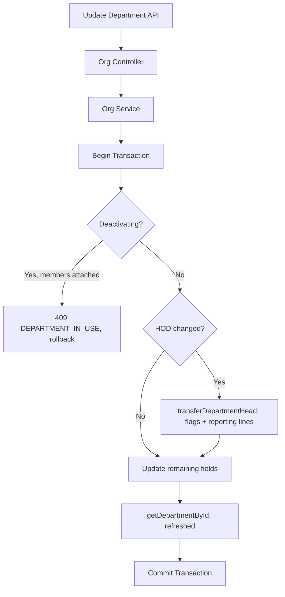

# Organization Structure APIs

**Base URL:** `/api/v1/organizations`  
**Source of Truth:** `location.routes.js`, `department.routes.js`, `location.controller.js`, `department.controller.js`, `organization.service.js`, `organization.repository.js`  
**Last Verified:** September 6, 2026

> **Note:** The specific function and ORM method names (e.g., `Organization.create()`) used in the internal execution flows are conceptual/dummy names intended to clearly illustrate the business logic. The internal execution logic, database interactions, transactions, side-effects, and validations described are strictly accurate and verified against the actual codebase.

---

## 1. Create Location

### Business Purpose
Allows an HR administrator to add a new physical or virtual work location for the organization. This acts as the foundational unit for geofencing rules and department assignments later in the workflow.

### Endpoint Contract
- **Method:** `POST`
- **Full Endpoint:** `/api/v1/organizations/locations`
- **Authentication:** Required. Bearer token.
- **Authorization:** `super-admin`, `admin`, `hr`.
- **Content-Type:** `application/json`

**Request Body:**
```json
{
  "name": "Headquarters",
  "address": "123 Main St",
  "city": "Mumbai",
  "state": "Maharashtra",
  "country": "India",
  "zip_code": "400001",
  "timezone": "Asia/Kolkata",
  "is_active": true
}
```

### Validation Rules
- `name`: String. Required. Max 100 characters.
- `address`: String. Optional.
- `city`: String. Optional. Max 100 characters.
- `state`: String. Optional. Max 100 characters.
- `country`: String. Optional. Max 100 characters.
- `zip_code`: String. Optional. Max 20 characters.
- `timezone`: String. Optional. Max 50 characters. Default UTC if not provided.
- `is_active`: Boolean. Optional. Default true.

### Complete Internal Execution Flow
```text
POST /api/v1/organizations/locations
        ↓
AuthMiddleware.authenticate()
        ↓
AuthMiddleware.authorize(['super-admin', 'admin', 'hr'])
        ↓
ValidationMiddleware
        ↓
OrganizationController.handlePostLocation()
        ↓
OrganizationService.createLocation()
        ↓
OrganizationRepository.createLocation()
        ↓
Database Insert (organization_locations)
        ↓
HTTP 201 Created
```

### Database Operations
- **Creates:** `organization_locations` table.
  - **Data:** `{ org_id: req.user.orgId, ...payload }`
- **Transactions**: No transaction required as it's a single table insert.
- **Uniqueness (migration 00042):** location `name` is unique per organization, case-insensitively (`(org_id, lower(name))`). A duplicate name returns `409 LOCATION_NAME_EXISTS`.

### Response Structure
**201 Created**
```json
{
  "success": true,
  "message": "Location created successfully",
  "data": {
    "id": "uuid-v4",
    "name": "Headquarters",
    "city": "Mumbai"
  }
}
```

### Frontend Integration
- **When to call**: Upon submitting the "Add New Location" form in Organization Settings.
- **On success**: Refresh the locations list to display the newly added record.

---

## 2. Get Locations

### Purpose
Retrieves all locations for the authenticated user's organization.

### Endpoint
```
GET /api/v1/organizations/locations
```

### Authentication and Authorization
- **Authentication:** Required. Bearer token.
- **Role:** `super-admin`, `admin`, `hr`, `manager`, `employee` (all org roles).

### Internal Working
- Fetches from `organization_locations` where `org_id = user.orgId`.
- Includes inactive locations. Ordered by `name` ASC.

### Response Structure
**200 OK**
```json
{
  "success": true,
  "message": "Locations fetched successfully",
  "data": [
    {
      "id": "uuid-v4",
      "name": "Headquarters",
      "city": "Mumbai",
      "is_active": true
    }
  ]
}
```

---

## 3. Update Location

### Business Purpose
Updates an existing location's details or status (active/inactive). This is essential when physical offices move or close.

### Endpoint Contract
- **Method:** `PUT`
- **Full Endpoint:** `/api/v1/organizations/locations/:id`
- **Authentication:** Required. Bearer token.
- **Authorization:** `super-admin`, `admin`, `hr`.

**Path Parameter:** `id` (UUIDv4).
**Body:** Same fields as Create Location, all optional.

### Complete Internal Execution Flow
```text
PUT /api/v1/organizations/locations/:id
        ↓
AuthMiddleware.authenticate()
        ↓
AuthMiddleware.authorize(['super-admin', 'admin', 'hr'])
        ↓
OrganizationController.handlePutLocation()
        ↓
OrganizationService.updateLocation()
        ↓
OrganizationRepository.updateLocation()
        ↓
Database Update (organization_locations)
        ↓
HTTP 200 OK
```

### Database Operations
- **Updates**: `organization_locations`.
- **Query**: `UPDATE organization_locations SET ... WHERE id = :id AND org_id = :orgId` (Tenant isolation enforced).
- **Uniqueness (migration 00042):** renaming to a name already used by another location in the same org returns `409 LOCATION_NAME_EXISTS` (case-insensitive).

### What Can Break If This API Changes?
- **Geofencing**: If a location's lat/long or timezone fields are added/modified here, it directly impacts the Attendance Clock-In geofence calculations.

### Response Structure
**200 OK**
```json
{
  "success": true,
  "message": "Location updated successfully"
}
```

---

## 4. Create Department

### Business Purpose
Allows an HR administrator to create a new department, optionally linking it to a specific location and assigning a Head of Department (HOD). This sets up the logical structure for hierarchical reporting.

### Endpoint Contract
- **Method:** `POST`
- **Full Endpoint:** `/api/v1/organizations/departments`
- **Authentication:** Required. Bearer token.
- **Authorization:** `super-admin`, `admin`, `hr`.
- **Content-Type:** `application/json`

**Request Body:**
```json
{
  "name": "Engineering",
  "description": "Software development team",
  "location_id": "uuid-v4",
  "head_of_department_id": "user-uuid-v4",
  "is_active": true
}
```

### Validation Rules
- `name`: String. Required. Max 100 characters.
- `description`: String. Optional.
- `location_id`: UUIDv4. Optional.
- `head_of_department_id`: UUIDv4. Optional. Must be a user with `hr` or `manager` role.
- `is_active`: Boolean. Optional. Default true.

### Complete Internal Execution Flow
```text
POST /api/v1/organizations/departments
        ↓
AuthMiddleware.authenticate()
        ↓
AuthMiddleware.authorize(['super-admin', 'admin', 'hr'])
        ↓
OrganizationController.handlePostDepartment()
        ↓
OrganizationService.createDepartment()
        ↓
BEGIN TRANSACTION
        ↓
(If HOD provided) _assertValidHod() — active member, not a plain employee
        ↓
(If location) checkLocationBelongsToOrg()
        ↓
OrganizationRepository.createDepartment(head_of_department_id: null)  ← created head-less first
        ↓
(If HOD provided) transferDepartmentHead()  ← sets department_head flag, JOINS the head to this
                                              department (department_id + name), adopts department
                                              orphans, creates reporting mappings
        ↓
getDepartmentById() — refreshed object
        ↓
COMMIT TRANSACTION
        ↓
HTTP 201 Created
```

### Every Function Called
**Function**: `createDepartment(actorUser, payload)`
- **File**: `src/modules/organization/services/organization.service.js`
- **Purpose**: Creates the department while validating HOD rules, in one transaction.
- **Input**: Actor user, Department Payload.
- **Database interaction**: Reads `user_roles` (HOD eligibility) and `organization_locations` (location belongs to org). Creates `organization_departments`; when a head is supplied, routes it through the single HOD path so the profile flag, orphan adoption and reporting mappings all happen exactly as they do on update.
- **Failure behavior**: Throws `400 INVALID_HOD_ROLE` if an employee is assigned as HOD, `404 USER_NOT_FOUND` if the HOD is not an active member, `404 LOCATION_NOT_FOUND` if the location is not in the org, `409 DEPARTMENT_NAME_EXISTS` on a duplicate name. The whole thing rolls back on any failure.

### Database Operations
- **Transactions:** Yes — a single `sequelize.transaction()` wraps the create, the HOD assignment, orphan adoption and mapping creation. A department created **with** a head now behaves identically to one where the head is assigned a moment later.
- **Read:** `user_roles` (HOD eligibility), `organization_locations` (belongs-to-org).
- **Create:** `organization_departments`, and (when a head is supplied) `user_reporting_mappings` + role-profile flag updates via `transferDepartmentHead`.
- **Uniqueness (migration 00042):** department `name` is unique per organization, case-insensitively (`(org_id, lower(name))`) → `409 DEPARTMENT_NAME_EXISTS` on a duplicate.

### Critical Invariants
- An `employee` role cannot be assigned as `head_of_department_id`.
- A department created with a head is fully wired (flag + orphan adoption + mappings), not just a bare row.
- **The head is a member of the department they head (changed 2026-10-02).** Assigning a head now
  writes `department_id` + the denormalized `department` name on that user's role profile when they
  have none. Previously only the `department_head` boolean was set, so a head stayed outside their
  own department: `countProfilesInDepartment()` reported 0 members for a headed department (which
  let it be deactivated) and every `department_id`-keyed roster, filter and report omitted its head.
  A candidate who already belongs to a **different** department is refused with
  `409 HOD_IN_OTHER_DEPARTMENT` instead of being silently relocated — move them first with
  `PUT /organizations/users/:id/department-transfer` (`is_new_hod: true` does both atomically).
  A candidate with no role-profile row at all is `404 HOD_PROFILE_NOT_FOUND`.

### Response Structure
Returns the **full department object** (the refreshed record), not just id/name.

**201 Created**
```json
{
  "success": true,
  "message": "Department created successfully",
  "data": {
    "id": "uuid-v4",
    "name": "Engineering"
  }
}
```

---

## 5. Get Departments

### Purpose
Retrieves all departments for the organization. Can be optionally filtered by a specific location.

### Endpoint
```
GET /api/v1/organizations/departments
```

### Authentication and Authorization
- **Authentication:** Required. Bearer token.
- **Role:** `super-admin`, `admin`, `hr`, `manager`, `employee` (all org roles).

### Request Structure
**Query Parameters:**
- `location_id`: UUIDv4. Optional. Filters results to a specific location.

### Internal Working
- Fetches from `organization_departments` joining `organization_locations` (to include location name) and `users`/`user_profiles` (to include HOD name).
- Includes inactive departments. Ordered by `name` ASC.

### Response Structure
**200 OK**
```json
{
  "success": true,
  "message": "Departments fetched successfully",
  "data": [
    {
      "id": "uuid-v4",
      "name": "Engineering",
      "location_id": "loc-uuid",
      "location_name": "Headquarters",
      "head_of_department_id": "user-uuid",
      "head_of_department_name": "Jane Smith",
      "is_active": true
    }
  ]
}
```

---

## 6. Update Department (HOD Transfer)

### Business Purpose
Updates department details. If the `head_of_department_id` is changed, this API invokes the complex atomic **HOD Transfer** process to automatically re-route all subordinate reporting lines to the new HOD, preventing orphaned employees.

### Endpoint Contract
- **Method:** `PUT`
- **Full Endpoint:** `/api/v1/organizations/departments/:id`
- **Authentication:** Required. Bearer token.
- **Authorization:** `super-admin`, `admin`, `hr`.

**Path Parameter:** `id` (UUIDv4).
**Body:**
```json
{
  "name": "Engineering (Updated)",
  "head_of_department_id": "new-manager-uuid-v4"
}
```

### Complete Internal Execution Flow
```text
PUT /api/v1/organizations/departments/:id
        ↓
AuthMiddleware.authenticate()
        ↓
AuthMiddleware.authorize(['super-admin', 'admin', 'hr'])
        ↓
OrganizationController.handlePutDepartment()
        ↓
OrganizationService.updateDepartment()
        ↓
BEGIN TRANSACTION   ← the head change AND the field update are now ONE atomic unit
        ↓
(If is_active -> false) countProfilesInDepartment(); reject 409 DEPARTMENT_IN_USE if members attached
        ↓
(If head_of_department_id present)
      _assertValidHod(new HOD)  (skipped when clearing to null)
      transferDepartmentHead()  ← department_head flag + orphan adoption + reporting-line transfer
        ↓
(If location_id) checkLocationBelongsToOrg()
        ↓
(If any remaining fields) OrganizationRepository.updateDepartment()
        ↓
getDepartmentById()  ← refreshed object
        ↓
COMMIT TRANSACTION
        ↓
HTTP 200 OK  (returns the department object)
```

### Every Function Called
**Function**: `transferReportingLines(orgId, departmentId, oldManagerId, newManagerId, transaction)`
- **File**: `src/modules/organization/repositories/user_reporting_mapping.repository.js`
- **Purpose**: Rewires the tree graph of reporting managers.
- **Why it is called**: To ensure that employees who reported to the old HOD now report to the new HOD, maintaining the approval chain for Attendance and Leave requests.
- **Database interaction**: 
  - Reads active mappings where `manager_id = oldManagerId` and the subordinate belongs to `departmentId`.
  - Updates old mappings (`is_active: false`).
  - Creates new mappings (`is_active: true`, `manager_id: newManagerId`).

### API Dependency Tree


### Database Operations
- **Transactions:** Yes — a **single** `sequelize.transaction()` now wraps the deactivation guard, the HOD transfer AND the remaining field update. Previously `transferDepartmentHead` opened and committed its own transaction and the field update ran in a second, separate one; a failure in between could leave the head changed but the name/location not, with no rollback. Now either all of it lands or none of it does.
- **Update:** `organization_departments`, `user_reporting_mappings`, `manager_profiles`/`hr_profiles`/`employee_profiles`.
- **Deactivation guard (S25):** setting `is_active: false` while role profiles still point at the department (a non-zero `department_id` count across the three profile tables) is rejected with `409 DEPARTMENT_IN_USE` and the attached-member count — HR must reassign or transfer those members first.
- **Name uniqueness (migration 00042):** renaming to a name already used by another department in the same org returns `409 DEPARTMENT_NAME_EXISTS` (case-insensitive, enforced by a unique index on `(org_id, lower(name))`).

### Side Effects
- **Reporting Lines:** The entire hierarchy under this department is re-wired instantly. Managers and HR dashboards will immediately reflect the new team structure, and any future attendance approvals will route to the new HOD.

### Response Structure
**Always returns the department object**, even when only the head changed — previously an HOD-only update returned `{ success: true }` with no `data`, forcing the frontend into a follow-up GET.

**200 OK**
```json
{
  "success": true,
  "message": "Department updated successfully",
  "data": {
    "id": "uuid-v4",
    "name": "Engineering (Updated)",
    "location_id": "loc-uuid-v4",
    "head_of_department_id": "new-manager-uuid-v4",
    "is_active": true
  }
}
```

### Error Flow
| Status | Code | Cause |
|---|---|---|
| 400 | `INVALID_HOD_ROLE` | New HOD is a plain employee (not a manager/hr). |
| 404 | `USER_NOT_FOUND` | New HOD is not an active member of this org. |
| 404 | `LOCATION_NOT_FOUND` | New `location_id` does not belong to this org. |
| 404 | `HOD_PROFILE_NOT_FOUND` | New HOD is a member but has no role-profile row. |
| 409 | `DEPARTMENT_IN_USE` | Tried to deactivate a department that still has members assigned. |
| 409 | `DEPARTMENT_NAME_EXISTS` | Renamed to a name already used by another department in the org. |
| 409 | `HOD_IN_OTHER_DEPARTMENT` | New HOD already belongs to another department — transfer them in first. |

### Frontend Integration
- **When to call**: When an HR Admin saves changes in the Department Edit modal.
- **UI UX**: If the HOD is being changed, the frontend should show a warning prompt: "This will transfer all direct reports to the new Head of Department. Continue?"
- **UI UX (new 2026-10-02)**: the HOD picker should prefer candidates whose `department_id` is empty
  or already this department. Picking a manager/HR who belongs to another department now returns
  `409 HOD_IN_OTHER_DEPARTMENT`; offer the department-transfer flow (`is_new_hod: true`) instead of
  surfacing a raw error. Note that a newly assigned head is now counted as a member of the
  department, so `DEPARTMENT_IN_USE` can appear for a department that looked empty before.
