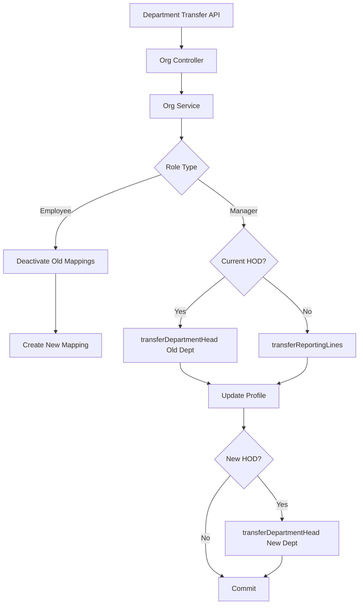

# Organization Employee APIs

**Base URL:** `/api/v1/organizations/employees`  
**Source of Truth:** `employee.routes.js`, `employee.controller.js`, `organization.service.js`  
**Last Verified:** September 6, 2026

> **Note:** The specific function and ORM method names (e.g., `Organization.create()`) used in the internal execution flows are conceptual/dummy names intended to clearly illustrate the business logic. The internal execution logic, database interactions, transactions, side-effects, and validations described are strictly accurate and verified against the actual codebase.

---

## 1. Get Employees List

### Purpose
Fetches a list of employees for the organization. The `purpose` query parameter dictates which fields are returned, optimizing payloads for different frontend components (e.g., HR dashboards vs. Shift Assignment modals). Handles deduplication for users with multiple roles (prioritizing Manager > HR > Employee).

### Endpoint
```
GET /api/v1/organizations/employees
```

### Authentication and Authorization
- **Authentication:** Required. Bearer token.
- **Role:** `super-admin`, `admin`, `hr`, `manager`.

### Request Structure
**Query Parameters:**
- `purpose`: String. **Required.** Determines the shape of the returned data.
  - Allowed values: `all_manager_list`, `all_hr_list`, `all_employee_list`, `shift_assignment`, `emp_report`. (No `general` — an unknown value is rejected with `400`.)
- `include_inactive`: Boolean. Optional (default `false`).
- `search`: String. Optional. Max 150 chars. Case-insensitive `ILIKE` across identifier/email, first/last/display name, employee_code, and designation.
- `department_id`: UUIDv4. Optional. Matched across the employee/manager/hr profile that the user actually holds.
- `page`: Integer ≥ 1. Optional (default `1`).
- `limit`: Integer 1–100. Optional (default `20`).

### Internal Working
1. **Scope resolution (server-side):** the caller's data scope is resolved from `user_reporting_mappings`, not denormalized `reporting_person` fields. HR/admin/super-admin resolve to a global scope (whole org); a manager resolves to their accessible `user_ids`. An empty manager scope short-circuits to an empty page **before** any query runs.
2. **Filtering & pagination are pushed into SQL.** `search`, `department_id`, the manager's `user_ids` scope, and the role filter implied by `all_{manager,hr,employee}_list` all become `WHERE` conditions, and the DB applies `LIMIT`/`OFFSET`. This is why the `pagination.total` count is exact for the filtered set — filtering a fetched page would under-count. Ordering is deterministic (`created_at ASC, id ASC`) so pages never overlap or skip rows.
3. **`include_inactive`:** the `user` join is a LEFT JOIN. By default only `status = 'active'` accounts are returned; `include_inactive=true` **surfaces suspended accounts** (previously an inner join dropped them entirely, so HR could not see a suspended user even when asking for inactives).
4. **Deduplication by `user_id`** is a no-op safety net: the unique `(org_id, user_id)` index means a user holds exactly one role row per org, so this never drops a legitimate row and cannot shorten a page.
5. **Hierarchy-scoped projection:** a manager always receives the roster-safe view (PAN/UAN/addresses/DOB/personal_email/marital_status stripped), regardless of the `purpose` they send. HR/admin behavior is unchanged.
6. **Purpose Filtering/Mapping (global approvers only):**
   - `all_*_list`: filtered by the requested role in SQL; returns a slim object (name, email, contact, role, department, designation, avatar, work_location, is_active).
   - `shift_assignment`: returns only scheduling fields (name, email, role, department, work_mode, work_location).
   - `emp_report`: returns the fully hydrated object with all 30+ fields (pan, uan, addresses, etc.).

### Response Structure
**200 OK** (Example for `shift_assignment`) — now a paginated envelope (`data` + `pagination`):
```json
{
  "success": true,
  "message": "Employees fetched successfully",
  "data": [
    {
      "user_id": "uuid-1",
      "name": "Jane Smith",
      "email": "jane@example.com",
      "role": "employee",
      "department": "Engineering",
      "work_mode": "hybrid",
      "work_location": "Headquarters"
    }
  ],
  "pagination": { "total": 137, "page": 1, "limit": 20, "total_pages": 7 }
}
```

---

## 2. Get Employee Details (By ID)

### Purpose
Fetches the complete profile and hierarchy data for a specific employee. Includes resolved names for their Reporting Person and Department Head.

### Endpoint
```
GET /api/v1/organizations/employees/:id
```

### Authentication and Authorization
- **Authentication:** Required. Bearer token.
- **Role:** `super-admin`, `admin`, `hr`, `manager`.

### Request Structure
**Path Parameter:** `id` (UUIDv4) - The `user_id`.

### Internal Working
1. **Scope Check:** A strict BOLA/IDOR check runs *before* the existence lookup. An out-of-scope id and a non-existent id both return a uniform `403 Forbidden` for managers to prevent user enumeration. Self and global approvers are always allowed.
2. Fetch `user_roles` linking the requested user and current org.
3. Determine primary role profile.
4. Resolve `reporting_person` ID to actual Name/Email.
5. Resolve `department_id` to fetch the department, then resolve `head_of_department_id` to actual Name/Email.
6. Merge all data into a comprehensive response object.

### Response Structure
**200 OK**
```json
{
  "success": true,
  "message": "Employee fetched successfully",
  "data": {
    "user_id": "uuid-v4",
    "name": "Jane Smith",
    "email": "jane@example.com",
    "role": "employee",
    "department": "Engineering",
    "designation": "Backend Dev",
    "reporting_person_details": {
      "name": "Manager Bob",
      "email": "bob@example.com"
    },
    "department_head_details": {
      "name": "Director Alice",
      "email": "alice@example.com"
    },
    "is_active": true,
    "status": "active"
  }
}
```

---

## 3. Update Employee Status

### Business Purpose
Allows an HR to temporarily suspend or reactivate an employee's access to the organization (e.g., during a leave of absence or disciplinary action).

### Endpoint Contract
- **Method:** `PATCH`
- **Full Endpoint:** `/api/v1/organizations/employees/:id/status`
- **Authentication:** Required. Bearer token.
- **Authorization:** `hr`, `super-admin`, `admin`.

**Path Parameter:** `id` (UUIDv4) - The `user_id`.
**Body:**
```json
{
  "is_active": false
}
```

### Complete Internal Execution Flow
```text
PATCH /api/v1/organizations/employees/:id/status
        ↓
AuthMiddleware.authenticate()
        ↓
AuthMiddleware.authorize(['super-admin', 'admin', 'hr'])
        ↓
OrganizationController.handleUpdateEmployeeStatus()
        ↓
OrganizationService.updateEmployeeStatus()
        ↓
UserRole.update()
        ↓
HTTP 200 OK
```

### Internal Working
Updates `is_active` boolean in the `user_roles` table for this user/org combination.
*Note: This does not affect the global `users.status`, meaning the user can still log into other organizations they belong to.*

### Database Operations
- **Update:** `user_roles` table (`UPDATE user_roles SET is_active = :status WHERE user_id = :id AND org_id = :orgId`).

### Response Structure
**200 OK**
```json
{
  "success": true,
  "message": "Employee status updated successfully"
}
```

---

## 4. Remove (Soft Delete) Employee

### Business Purpose
Removes an employee from the organization permanently (soft delete). Removes their role access and severs active reporting lines. Used when an employee resigns or is terminated.

### Endpoint Contract
- **Method:** `DELETE`
- **Full Endpoint:** `/api/v1/organizations/employees/:id`
- **Authentication:** Required. Bearer token.
- **Authorization:** `hr`, `super-admin`, `admin`.

### Complete Internal Execution Flow
```text
DELETE /api/v1/organizations/employees/:id
        ↓
AuthMiddleware.authenticate()
        ↓
AuthMiddleware.authorize(['super-admin', 'admin', 'hr'])
        ↓
OrganizationController.handleSoftDeleteEmployee()
        ↓
OrganizationService.softDeleteEmployee()
        ↓
UserRole.findOne() (Throws 404 if missing)
        ↓
BEGIN TRANSACTION
        ↓
UserRole.update(is_active: false, deleted_at: NOW)
        ↓
UserReportingMappingRepository.deactivateAllUserMappings()
        ↓
COMMIT TRANSACTION
        ↓
HTTP 200 OK
```

### Internal Working
1. Find user in the org. Throw 404 if missing.
2. Start DB transaction.
3. Update `user_roles` setting `deleted_at = now()` and `is_active = false`.
4. Deactivate all their active reporting mappings (both where they are the subordinate AND where they are the manager). Reason: "User Removed from Organization".
5. Note: If this user is an HOD, they must be manually replaced on the Department before being removed, or the department will be left headless.
6. Commit transaction.

### Every Function Called
**Function**: `deactivateAllUserMappings(userId, transaction)`
- **File**: `src/modules/organization/repositories/user_reporting_mapping.repository.js`
- **Purpose**: Cleans up the tree graph to prevent dead branches.
- **Why it is called**: An employee cannot continue to report to a manager if they are fired, and a fired manager cannot have active subordinates.
- **Database interaction**: `UPDATE user_reporting_mappings SET is_active = false WHERE manager_id = :id OR subordinate_id = :id`.

### Response Structure
**200 OK**
```json
{
  "success": true,
  "message": "Employee successfully removed from organization"
}
```

---

## 5. Department Transfer

### Business Purpose
A highly complex, atomic operation that handles moving a user between departments, modifying their reporting lines, and managing Head of Department (HOD) handovers.

### Endpoint Contract
- **Method:** `PUT`
- **Full Endpoint:** `/api/v1/organizations/users/:id/department-transfer`
- **Authentication:** Required. Bearer token.
- **Authorization:** `hr`, `super-admin`, `admin`.

**Request Body:**
```json
{
  "role": "employee", 
  "new_department_id": "uuid-v4", 
  "new_manager_id": "manager-uuid", 
  "is_current_hod": false,
  "is_new_hod": false,
  "replacement_hod_id": null,
  "old_dept_fallback_manager_id": null
}
```

### Validation Rules
- `role`: Enum (employee, hr, manager). Required.
- `new_department_id`: UUIDv4. Optional (null implies removing them from any department).
- **If role = employee:**
  - If changing/adding department: `new_manager_id` is required UNLESS the `new_department_id` has an active HOD, in which case it auto-defaults to that HOD.
  - If removing department: `new_manager_id` is explicitly required.
- **If role = manager/hr (and they are the CURRENT HOD):**
  - `is_current_hod` must be true.
  - `replacement_hod_id` is strictly REQUIRED (cannot leave the old department headless).
- **If role = manager/hr (and they are NOT the current HOD):**
  - `old_dept_fallback_manager_id` is required (to hand over their existing subordinates). If not provided, it falls back to the old department's HOD.

### Complete Internal Execution Flow
```text
PUT /users/:id/department-transfer
        ↓
OrganizationController.handlePutDepartmentTransfer()
        ↓
OrganizationService.transferDepartment()
        ↓
BEGIN TRANSACTION
        ↓
Lock Profile (EmployeeProfile | ManagerProfile)
        ↓
Is transferring an Employee?
 ├── YES:
 │    ↓
 │    Resolve newReportingPerson
 │    ↓
 │    Profile.update(department_id, reporting_person)
 │    ↓
 │    Deactivate active mappings
 │    ↓
 │    UserReportingMapping.create(new mapping)
 │
 └── NO (Transferring Manager/HR):
      ↓
      Is is_current_hod == true?
       ├── YES: transferDepartmentHead(old_dept, replacement_hod)
       └── NO: transferReportingLines(old_manager, fallback_manager)
      ↓
      Profile.update(new department_id)
      ↓
      Is is_new_hod == true?
       ├── YES: transferDepartmentHead(new_dept, transferring_user)
       └── NO: (No action)
        ↓
COMMIT TRANSACTION
        ↓
HTTP 200 OK
```

### Internal Working
1. **Fetch Profile:** Lock and load the specific role profile (EmployeeProfile, ManagerProfile, or HrProfile).
2. **Path A: Transferring an Employee**
   - Determine `newReportingPerson` (from payload or auto-fallback to new dept's HOD).
   - Update profile `department_id` and `reporting_person`.
   - Call `userReportingMappingRepository.deactivateActiveMappingsForEmployee`.
   - Create a NEW `user_reporting_mappings` record pointing the employee to the `newReportingPerson`.
3. **Path B: Transferring a Manager/HR**
   - **Handling the OLD Department:**
     - If `is_current_hod` = true: Invoke `transferDepartmentHead` to atomically swap the `replacement_hod_id` into the old department and re-wire all subordinates to the replacement.
     - If `is_current_hod` = false: Invoke `transferReportingLines` to re-wire this specific manager's current subordinates to the `old_dept_fallback_manager_id`.
   - **Updating Profile:** Change `department_id` on their profile.
   - **Handling the NEW Department:**
     - If `is_new_hod` = true: Invoke `transferDepartmentHead` to formally make them the HOD of the new department, auto-rewiring all employees in that department to report to them.
4. **Commit:** Commit the PostgreSQL transaction.

### Services Used by the API
- **OrganizationService**: Contains the complex transfer logic.
- **UserReportingMappingRepository**: Handles the low-level SQL to swap `manager_id` constraints atomically.

### API Dependency Tree


### Database Operations
- **Transactions:** Yes, fully wrapped. Critical invariant.

### Concurrency and Race Conditions
- **Row Locking**: The profile row is locked for update (`transaction.LOCK.UPDATE`) at the start of the process to prevent two concurrent admins from transferring the same employee simultaneously.

### Side Effects
- This API fundamentally alters the reporting hierarchy. It can update dozens of rows in the `user_reporting_mappings` table simultaneously to ensure the organizational chart remains unbroken.

### Response Structure
**200 OK**
```json
{
  "success": true,
  "message": "Department transfer completed successfully"
}
```

### Frontend Integration
- **When to Call:** When an HR submits the "Transfer Department" modal.
- **Required Logic:** The frontend UI must be dynamic. If the selected user is an Employee, show a "New Manager" dropdown. If the selected user is a Manager who is currently an HOD, force the HR to select a "Replacement HOD" before enabling the Submit button.

---

## 6. Update Employee Profile (By Manager)

### Business Purpose
Allows managers to edit a direct report's whitelisted personal fields.

### Endpoint Contract
- **Method:** `PATCH`
- **Full Endpoint:** `/api/v1/organizations/employees/:id`
- **Authentication:** Required. Bearer token.
- **Authorization:** `super-admin`, `admin`, `hr`, `manager`.

### Request Structure
**Path Parameter:** `id` (UUIDv4) - The `user_id` of the direct report.
**Body:** Allowed personal fields (e.g., name, phone_number, avatar_url).

### Internal Working
1. Cross-team id results in a 403 Forbidden.
2. Self-edit via this endpoint results in a 400 Bad Request (users must use `/me`).
3. Role, department, designation, employee_code, and leave-gate demographics are not editable via this route.
4. Writes to `user_profiles` and the specific role profile atomically via a shared `_writeProfileFields` helper (also reused by `updateMyProfile`).

---

## 7. Get My Profile

### Business Purpose
Fetches the logged-in user's own full profile. Scoped to `actorUser.id` (no IDOR) and reuses `getEmployeeById`.

### Endpoint Contract
- **Method:** `GET`
- **Full Endpoint:** `/api/v1/organizations/me`
- **Authentication:** Required. Bearer token.
- **Authorization:** All org roles.

### Request Structure
**Body:** None.

---

## 8. Update My Profile

### Business Purpose
Updates the logged-in user's own personal fields. Implements a strict whitelist, rejecting edits to `department`, `designation`, `gender`, `marital_status`, `employee_code`, and `pan_number` (unknown=false). Updates both user and profile tables in one transaction.

### Endpoint Contract
- **Method:** `PATCH`
- **Full Endpoint:** `/api/v1/organizations/me`
- **Authentication:** Required. Bearer token.
- **Authorization:** All org roles.

### Request Structure
**Body:** Allowed personal fields (e.g., name, phone, etc.).

---

## 9. Get Employee Directory

### Business Purpose
Fetches a public-safe, org-wide colleague directory. **Every member may look up every other _active_ member** — it is deliberately NOT hierarchy-scoped, which is only safe because the projection is public-safe: it omits addresses, PAN/UAN, DOB, personal_email, and marital_status, returning only name, email, avatar, role, department, designation, and work_location. This is a dedicated method (not a `purpose` on Get Employees) precisely so the hierarchy short-circuit there can never leak the roster projection to a plain employee.

### Endpoint Contract
- **Method:** `GET`
- **Full Endpoint:** `/api/v1/organizations/directory`
- **Authentication:** Required. Bearer token.
- **Authorization:** All org roles (employee, manager, hr, admin, super-admin).

### Request Structure
**Query Parameters** (validated; unknown keys are stripped):
- `search`: String. Optional. Max 150 chars. Same case-insensitive `ILIKE` matching as Get Employees.
- `department_id`: UUIDv4. Optional.
- `page`: Integer ≥ 1. Optional (default `1`).
- `limit`: Integer 1–100. Optional (default `20`).

There is no `purpose` (the directory has one fixed projection) and no `include_inactive` (a directory only ever lists currently-active members — `includeInactive` is forced `false` at the DB layer, with a belt-and-suspenders `is_active` guard dropping any suspended account).

### Response Structure
**200 OK** — paginated envelope (`data` + `pagination`):
```json
{
  "success": true,
  "message": "Directory fetched successfully",
  "data": [
    {
      "user_id": "uuid-1",
      "name": "Jane Smith",
      "email": "jane@example.com",
      "avatar_url": "https://...",
      "role": "employee",
      "department": "Engineering",
      "designation": "Backend Dev",
      "work_location": "Headquarters"
    }
  ],
  "pagination": { "total": 137, "page": 1, "limit": 20, "total_pages": 7 }
}
```


---

## 10. Update HR-Owned Employee Fields

### Business Purpose
Lets HR correct the fields that the personal-profile edits (§6, §8) deliberately exclude because leave depends on them:
- `gender` and `marital_status` gate gender- or marital-status-restricted leave types;
- `joining_date` drives leave pro-rata. Leave assignment refuses to guess it.

Before this endpoint, a gender set wrongly at invite could not be corrected by anyone, and a joining date missing at invite could never be added.

### Endpoint Contract
- **Method:** `PATCH`
- **Full Endpoint:** `/api/v1/organizations/employees/:id/hr-fields`
- **Authentication:** Required. Bearer token.
- **Authorization:** `hr` only (`HR_ONLY`). Not on yourself.

**Path Parameter:** `id` (UUIDv4) - The `user_id`.
**Body:**
```json
{
  "gender": "male",
  "marital_status": "married",
  "joining_date": "2022-05-16",
  "reason": "Gender was selected wrongly on the invitation"
}
```

**Validation:**
- `gender`: `male` · `female` · `other` · `prefer_not_to_say` · `null`. These match the profile column and the leave-type `allowed_genders` vocabulary.
- `marital_status`: string ≤ 50 or `null`.
- `joining_date`: `YYYY-MM-DD`, a real date. **Fill-once:** accepted only while the profile has no joining date. Changing an existing one would move payroll proration and tenure, so it is refused.
- `reason`: required, 3–500 characters.
- At least one of `gender`, `marital_status` or `joining_date` must be sent. Any other key is stripped.

### Complete Internal Execution Flow
```text
PATCH /api/v1/organizations/employees/:id/hr-fields
        ↓
AuthMiddleware.authenticate()
        ↓
AuthMiddleware.requireActiveOrg
        ↓
AuthMiddleware.authorize(['hr'])
        ↓
EmployeeController.handleUpdateHrOwnedFields()   (UUID check + Joi)
        ↓
OrganizationService.updateHrOwnedFields()
        ↓
OrganizationRepository.getEmployeeById()          (membership role → role profile)
        ↓
OrganizationRepository.updateRoleProfileFields()  (only changed fields; joining_date guarded on IS NULL)
        ↓
[ORG_AUDIT] log line (actor, target, reason, old → new)
        ↓
OrganizationService.getEmployeeById()
        ↓
HTTP 200 OK
```

### Internal Working
- **Self-edit:** an HR user editing their own record is refused (`SELF_EDIT_NOT_ALLOWED`); otherwise HR could grant themselves gender-gated leave.
- **Which table:** the write goes to the role profile of the member's **membership role**.
- **No-op values:** a value equal to the stored one is not written and does not appear in `changes`.
- **Concurrent fill:** the `joining_date` write carries a `joining_date IS NULL` guard. A concurrent fill that wins first makes this request fail with the same `409`, so it never silently overwrites.
- **Pending leave:** pending requests are not re-validated against the new gender or marital status. Future applications use the new values.
- **Audit:** the organization module has no audit table, so the change is recorded as a structured `[ORG_AUDIT]` log line carrying the reason.

### Database Operations
- **Read:** `user_roles` + `users` + role profiles (`getEmployeeById`).
- **Update:** the role-profile table for the member's role, `UPDATE … SET <changed fields> WHERE org_id = :orgId AND user_id = :id [AND joining_date IS NULL]`.

### Response Structure
**200 OK**
```json
{
  "success": true,
  "message": "Employee HR fields updated successfully",
  "data": {
    "user_id": "…", "name": "…", "gender": "male", "marital_status": "married", "joining_date": "2022-05-16",
    "…": "the same employee detail as GET /employees/:id",
    "changes": { "gender": { "from": "female", "to": "male" }, "joining_date": { "from": null, "to": "2022-05-16" } }
  }
}
```

**Errors:**

| HTTP | Code | When |
|---|---|---|
| 400 | `VALIDATION_ERROR` | Missing `reason`, no field to change, or a bad value |
| 400 | `INVALID_ID_FORMAT` | `id` is not a UUID |
| 400 | `SELF_EDIT_NOT_ALLOWED` | HR editing their own record |
| 404 | `EMPLOYEE_NOT_FOUND` | Unknown member |
| 404 | `PROFILE_NOT_FOUND` | The member has no role profile |
| 409 | `JOINING_DATE_ALREADY_SET` | A joining date is already on file |

---

## 11. HR Self-Setup: Setup Status & Job Profile Completion

### Business Purpose
The organization creator is provisioned **before** the org has any structure: at registration there
are no locations and no departments, so their `hr_profiles` row carries an employee code and
nothing else — no `joining_date`, `department_id`, `designation`,
`employment_type`, `gender` or `marital_status`. Every endpoint that can write those
fields on a member (§5 department transfer, §10 hr-fields) refuses a self-edit, and the creator is
normally the only HR in the org — so nobody could fill them. The practical damage of the blanks:

| Blank field | What breaks |
|---|---|
| `joining_date` | Leave policy assignment refuses the member (`NO_JOINING_DATE`); payroll excludes them (`joining_date_missing`); bonus tenure skips them; payslips / annual statements / experience letters print an empty DOJ; the attendance series loses its lower bound |
| `department_id` | Department rosters, filters, reports, department-scoped bonus rules and `countProfilesInDepartment()` all skip them |
| `location_id` | No work location on the profile; the attendance geofence has nothing to resolve and raises `geofence_unresolved`. **HR-owned — not fillable through §11.2** (see the note below) |
| `gender` / `marital_status` | Gender- and marital-status-gated leave types cannot be evaluated |

These two endpoints close that gap for the HR plane without weakening the self-edit bans: they only
ever **fill a blank**.

### 11.1 `GET /api/v1/organizations/me/setup-status`

- **Authentication:** Required. Bearer token.
- **Authorization:** `hr` only (`HR_ONLY`). Managers and employees have these fields set by HR.
- **Body:** none.

**200 OK**
```json
{
  "success": true,
  "message": "Setup status fetched successfully",
  "data": {
    "is_complete": false,
    "missing_fields": ["joining_date", "department_id", "designation", "employment_type", "gender", "marital_status"],
    "locked_fields": [],
    "current_values": {
      "joining_date": null, "department_id": null, "designation": null,
      "employment_type": null, "gender": null, "marital_status": null
    },
    "org_structure": {
      "locations_count": 0,
      "departments_count": 0,
      "can_set_department": false
    }
  }
}
```

**Field notes**
- `missing_fields` — still blank (SQL `NULL`), therefore writable through §11.2. This is the exact
  condition the fill-once write is guarded on, so anything listed here is accepted by §11.2.
- `locked_fields` — already on file. Sending one to §11.2 is a `409 FIELD_ALREADY_SET`; a real
  correction goes through §10 (gender / marital_status / joining_date) or §5 (department).
- `org_structure.can_set_department` — `false` means the org has no **active** department yet, so
  the wizard must send the user to create one first (`POST /organizations/departments`).
- `org_structure.locations_count` — org-structure readiness only. There is **no** `can_set_location`
  flag: `location_id` is not settable here (see the note below), so advertising one would mislead
  the wizard.
- **`work_mode` and `location_id` never appear** in `missing_fields`, `locked_fields` or
  `current_values`, and `is_complete` can be `true` while both are blank. See §11.2.
- This is a **soft gate**: nothing else in the API is blocked on `is_complete`.

### 11.2 `PATCH /api/v1/organizations/me/job-profile`

- **Authentication:** Required. Bearer token.
- **Authorization:** `hr` only (`HR_ONLY`).
- **Body:** at least one of the six fields (`reason` alone is rejected).

> **`work_mode` and `location_id` are NOT accepted here** (removed 2026-10-05). Both became inputs
> to attendance geofence *enforcement*, which makes this endpoint an authorization boundary for
> them: an HR whose own `work_mode` was blank could set it to `remote` and exempt themselves from
> geofencing, and one whose `location_id` was blank could choose their own geofence anchor. Sending
> either key is now a `400 VALIDATION_ERROR`, and a payload containing only those keys is a `400`
> because no recognized field remains. Both are corrected through §10 (`hr-fields`), which no HR can
> aim at themselves. Full rationale:
> `public/md_updates/2026-10-05_work_mode_enforcement_api_changes.md`.

```json
{
  "joining_date": "2024-04-01",
  "department_id": "41fd3123-076b-4380-a6e4-95d3a3cf78a4",
  "designation": "Founder & Head of People",
  "employment_type": "full_time",
  "gender": "male",
  "marital_status": "married",
  "reason": "First-run setup after registration"
}
```

**Validation**
- `joining_date`: `YYYY-MM-DD`, a real calendar date, not in the future (one day of slack past UTC
  today for orgs ahead of UTC), not before `1950-01-01`.
- `department_id`: UUIDv4, must belong to **this** org and be active.
- `designation`: 2–150 characters.
- `employment_type`: `full_time` · `part_time` · `contract` · `intern`.
- `gender`: `male` · `female` · `other` · `prefer_not_to_say`.
- `marital_status`: string ≤ 50.
- `reason`: optional, 3–500 characters, recorded in the audit log.
- `null` / `""` are rejected for every field — this endpoint fills blanks, it never clears a value.
- Any other key (`work_mode`, `location_id`, `employee_code`, `job_status`, `pan_number`,
  `reporting_person`, …) is stripped.

**Semantics**
- **Fill-once per field.** The write is guarded in SQL on "the column is still NULL", so a retried
  or duplicated request, and two concurrent requests, cannot both land — the loser gets
  `409 FIELD_ALREADY_SET`.
- Fields may be filled across several calls; a `department_id` offered later is still cross-checked
  against a `location_id` already on file — set by §10 — (`400 LOCATION_MISMATCH`).
- Writing `department_id` also refreshes the denormalized `department` name, which is what clears a
  stale `'Human Resources'` / `'General'` label.
- **Reporting lines and HOD-ship are NOT touched.** Joining a department does not make the caller
  report to its head, and does not make them its head — those stay with §5 and the department
  endpoints.
- Audited: `[ORG_AUDIT] {"action":"employee.job_profile.self_completed", …, "changes":{…}}`.

**200 OK**
```json
{
  "success": true,
  "message": "Job profile updated successfully",
  "data": {
    "profile": { "…": "the same shape as GET /organizations/me" },
    "changes": {
      "joining_date": { "from": null, "to": "2024-04-01" },
      "department_id": { "from": null, "to": "41fd3123-…" },
      "department": { "from": "Human Resources", "to": "HR Department" }
    },
    "setup_status": { "…": "the same shape as §11.1, recomputed after the write" }
  }
}
```

**Errors**

| HTTP | Code | When |
|---|---|---|
| 400 | `VALIDATION_ERROR` | No real field sent, bad enum, malformed/future/too-old `joining_date`, non-UUID id, `null`/`""` |
| 400 | `LOCATION_MISMATCH` | The department sits at a different location than the one in the payload or already on file |
| 400 | `DEPARTMENT_INACTIVE` | The target department is deactivated. (`LOCATION_INACTIVE` is no longer reachable here — `location_id` is not an accepted input) |
| 403 | `FORBIDDEN` | Caller is not `hr` |
| 404 | `PROFILE_NOT_FOUND` | No membership, or no role-profile row for the caller |
| 404 | `DEPARTMENT_NOT_FOUND` | The id does not belong to this org |
| 409 | `FIELD_ALREADY_SET` | One or more named fields already hold a value (message lists them), or a concurrent fill won the race |
