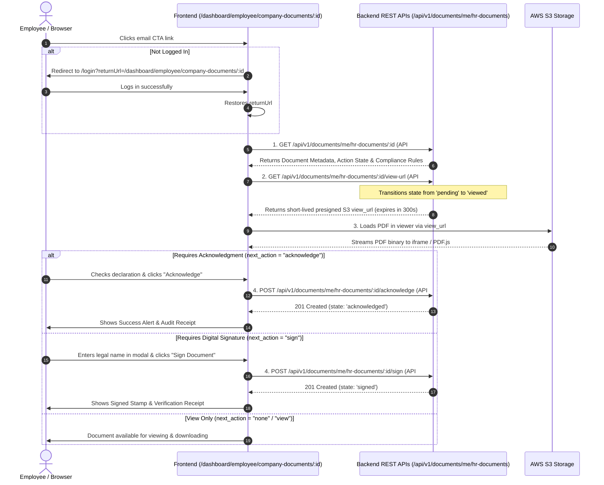

# Frontend Integration Guide: Company Document Viewer & Email Deep Link Routing

> **Audience:** Senior Frontend Engineers, Full-Stack Developers, UI/UX Engineers  
> **Topic:** Implementation specification for `/dashboard/employee/company-documents/:id`  
> **Source Module:** Document Module (Employee Self-Service Plane)  
> **Related Backend APIs:** #71, #72, #73, #74, #75  

---

## 1. Executive Summary & Problem Context

In our transactional email pipeline (specifically for events such as `letter_issued`, `document_published`, and `acknowledgement_pending`), the backend notification service constructs and emails a **Call-To-Action (CTA) Deep Link** formatted as:

```text
https://hrclouds.in/dashboard/employee/company-documents/:id
```
*(Example: `https://hrclouds.in/dashboard/employee/company-documents/0be27e21-c289-4136-813c-66ebb2d672f5`)*

### Why Does the Email Link Here Instead of Attaching the PDF or Sending an S3 Link?
1. **Security & Zero-Trust Architecture:** A presigned S3 URL inside an email inbox is an unrevokable bearer credential. If an email is forwarded, intercepted, or archived, the storage link can be abused. Furthermore, S3 URLs have short TTLs (typically 5–15 minutes) and would expire before the employee opens their email.
2. **Audit Trail & Legal Compliance:** Employment contracts, policies, and formal letters require strict evidence-grade tracking. Viewing, downloading, acknowledging, or signing a document must record the employee's authenticated user ID, IP address, user agent, and timestamp.
3. **Dynamic State & Action Gates:** A document might require employee acknowledgment or a typed digital signature. The web application is the only environment where these legal actions can be captured interactively.

---

## 2. Complete User Journey & State Flow



---

## 3. Backend REST API Specifications

The frontend page consumes five dedicated endpoints mounted on the employee self-service plane (`/api/v1/documents/me/hr-documents/*`). All requests require `Authorization: Bearer <JWT>`.

### 1. Fetch Document Metadata & Action State (API #71)
* **Route:** `GET /api/v1/documents/me/hr-documents/:id`
* **Purpose:** Initial payload containing document titles, dates, current recipient state, and required compliance actions.
* **Controller:** `document_org_self.controller.js:detail`

#### Success Response (`200 OK`):
```json
{
  "success": true,
  "message": "OK",
  "data": {
    "id": "e5c468e2-8954-469b-8149-6f916b23d9b4",
    "state": "pending",
    "due_on": "2026-10-15",
    "document": {
      "id": "0be27e21-c289-4136-813c-66ebb2d672f5",
      "title": "Promotion & Salary Revision Letter",
      "description": "Official confirmation of role elevation to Staff Engineer.",
      "display_status": "published",
      "is_actionable": true,
      "next_action": "sign",
      "requires_acknowledgement": true,
      "requires_signature": true,
      "document_type": {
        "id": "87771234-abcd-ef01-2345-6789abcdef01",
        "name": "Promotion Letter"
      }
    },
    "acknowledgement": {
      "required": true,
      "signature_required": true,
      "state": "pending",
      "due_on": "2026-10-15",
      "days_remaining": 7,
      "is_overdue": false,
      "is_blocking": false,
      "acknowledged_at": null,
      "signed_at": null
    }
  }
}
```

#### Key Fields the Frontend Must Inspect:
* `data.document.next_action`: Evaluated server-side. Possible values:
  * `'none'`: Document is view-only, or all required actions have been completed.
  * `'view'`: Employee has not opened the document yet.
  * `'acknowledge'`: Document requires an explicit checkbox acknowledgment.
  * `'sign'`: Document requires an electronic typed signature.
* `data.acknowledgement.is_overdue`: If `true`, render an urgent alert banner indicating the deadline has passed.
* `data.acknowledgement.is_blocking`: If `true`, indicates that organizational settings flag this document as mandatory/blocking.

---

### 2. Generate Secure S3 Preview URL (API #72)
* **Route:** `GET /api/v1/documents/me/hr-documents/:id/view-url?disposition=inline`
* **Purpose:** Generates a short-lived presigned AWS S3 preview link and transitions recipient state to `viewed`.
* **Query Parameters:**
  * `disposition`: `'inline'` (default, for iframe/embedded viewing) or `'attachment'` (for downloading).
* **Controller:** `document_org_self.controller.js:viewUrl`

#### Success Response (`200 OK`):
```json
{
  "success": true,
  "message": "OK",
  "data": {
    "view_url": "https://hrms-storage.s3.ap-south-1.amazonaws.com/org_documents/0be27e21...X-Amz-Signature=...",
    "expires_in": 300
  }
}
```

> **Important Frontend Behavior:**
> * `expires_in` is **300 seconds (5 minutes)**.
> * If the user leaves the tab open for more than 5 minutes, any page refresh or iframe reload will fail with S3 `RequestExpired`.
> * The frontend should implement a transparent refetch helper if the user requests a download or reloads the viewer.

---

### 3. Record Document Acknowledgment (API #73)
* **Route:** `POST /api/v1/documents/me/hr-documents/:id/acknowledge`
* **Purpose:** Formally acknowledges receipt and agreement.
* **Request Body:** `{}` (empty object)
* **Controller:** `document_org_self.controller.js:acknowledge`

#### Success Response (`201 Created` or `200 OK` on replay):
```json
{
  "success": true,
  "message": "OK",
  "data": {
    "already_acknowledged": false,
    "acknowledged_at": "2026-10-08T13:45:00.000Z",
    "state": "acknowledged"
  }
}
```

---

### 4. Record Electronic Signature (API #74)
* **Route:** `POST /api/v1/documents/me/hr-documents/:id/sign`
* **Purpose:** Captures an electronic typed legal signature.
* **Request Body:**
  ```json
  {
    "signer_name": "Rishi Ganeshe"
  }
  ```
* **Validation:** `signer_name` must be a non-empty string between 2 and 150 characters.
* **Controller:** `document_org_self.controller.js:sign`

#### Success Response (`201 Created` or `200 OK` on replay):
```json
{
  "success": true,
  "message": "OK",
  "data": {
    "already_signed": false,
    "signed_at": "2026-10-08T13:46:12.000Z",
    "signer_name": "Rishi Ganeshe",
    "state": "signed"
  }
}
```

---

### 5. Fetch Compliance Evidence / Audit Receipt (API #75)
* **Route:** `GET /api/v1/documents/me/hr-documents/:id/acknowledgement`
* **Purpose:** Retrieves the legal audit stamp after signing or acknowledging.
* **Controller:** `document_org_self.controller.js:myEvidence`

#### Success Response (`200 OK`):
```json
{
  "success": true,
  "message": "OK",
  "data": {
    "document_id": "0be27e21-c289-4136-813c-66ebb2d672f5",
    "state": "signed",
    "acknowledged_at": "2026-10-08T13:45:00.000Z",
    "signed_at": "2026-10-08T13:46:12.000Z",
    "signer_name": "Rishi Ganeshe",
    "evidence_captured": true
  }
}
```

---

## 4. Suggested UI / UX Architecture

The recommended page layout consists of a two-column or stacked layout:
1. **Top Header & Breadcrumb:** Back link to `/dashboard/employee/company-documents`, Document Title, Type Badge, and Download Button.
2. **Alert Banners (Dynamic):**
   * Red Banner: If `acknowledgement.is_overdue === true` $\rightarrow$ *"This document was due on [due_on] and is overdue."*
   * Yellow Banner: If `next_action === "acknowledge"` or `"sign"` $\rightarrow$ *"Action Required: Please review and complete below."*
   * Green Banner: If `acknowledgement.signed_at` exists $\rightarrow$ *"Completed: Digitally signed by [signer_name] on [date]."*
3. **Primary Document Viewer:**
   * Embedded `<iframe src={viewUrl} />` or PDF.js viewer with zoom and page controls.
4. **Bottom Sticky Action Bar:**
   * Contains the checkbox for acknowledgment, the "Sign" button, or the verified evidence timestamp.

---

## 5. Production-Ready React / TypeScript Reference Implementation

Below is a reference component illustrating the entire lifecycle:

```tsx
import React, { useEffect, useState, useCallback } from 'react';
import { useParams, useNavigate, useLocation } from 'react-router-dom';
import axios from 'axios';

interface DocumentDetail {
  id: string;
  state: 'pending' | 'viewed' | 'acknowledged' | 'signed';
  due_on: string | null;
  document: {
    id: string;
    title: string;
    description: string;
    next_action: 'none' | 'view' | 'acknowledge' | 'sign';
    requires_acknowledgement: boolean;
    requires_signature: boolean;
    document_type?: { name: string };
  };
  acknowledgement: {
    required: boolean;
    signature_required: boolean;
    is_overdue: boolean;
    due_on: string | null;
    acknowledged_at: string | null;
    signed_at: string | null;
  };
}

export const CompanyDocumentViewerPage: React.FC = () => {
  const { id } = useParams<{ id: string }>();
  const navigate = useNavigate();
  const location = useLocation();

  const [loading, setLoading] = useState<boolean>(true);
  const [detail, setDetail] = useState<DocumentDetail | null>(null);
  const [viewUrl, setViewUrl] = useState<string | null>(null);
  const [errorMessage, setErrorMessage] = useState<string | null>(null);

  // Interaction State
  const [acknowledgedChecked, setAcknowledgedChecked] = useState<boolean>(false);
  const [submittingAction, setSubmittingAction] = useState<boolean>(false);
  const [showSignModal, setShowSignModal] = useState<boolean>(false);
  const [signerName, setSignerName] = useState<string>('');

  // 1. Fetch Details & Presigned URL
  const loadDocumentData = useCallback(async () => {
    try {
      setLoading(true);
      setErrorMessage(null);

      // Fetch Metadata (API #71)
      const detailRes = await axios.get(`/api/v1/documents/me/hr-documents/${id}`);
      const data: DocumentDetail = detailRes.data.data;
      setDetail(data);

      // Fetch S3 Preview URL (API #72)
      const viewRes = await axios.get(`/api/v1/documents/me/hr-documents/${id}/view-url?disposition=inline`);
      setViewUrl(viewRes.data.data.view_url);

    } catch (err: any) {
      if (err.response?.status === 401) {
        navigate(`/login?returnUrl=${encodeURIComponent(location.pathname)}`);
        return;
      }
      if (err.response?.status === 404) {
        setErrorMessage('Document not found or you do not have permission to view it.');
      } else {
        setErrorMessage(err.response?.data?.message || 'Failed to load document.');
      }
    } finally {
      setLoading(false);
    }
  }, [id, navigate, location.pathname]);

  useEffect(() => {
    if (id) {
      loadDocumentData();
    }
  }, [id, loadDocumentData]);

  // 2. Handle Acknowledge Action (API #73)
  const handleAcknowledge = async () => {
    if (!acknowledgedChecked || !id) return;
    try {
      setSubmittingAction(true);
      await axios.post(`/api/v1/documents/me/hr-documents/${id}/acknowledge`, {});
      await loadDocumentData(); // Refresh state
    } catch (err: any) {
      alert(err.response?.data?.message || 'Acknowledgment failed.');
    } finally {
      setSubmittingAction(false);
    }
  };

  // 3. Handle Digital Sign Action (API #74)
  const handleSign = async () => {
    if (!signerName.trim() || !id) return;
    try {
      setSubmittingAction(true);
      await axios.post(`/api/v1/documents/me/hr-documents/${id}/sign`, {
        signer_name: signerName.trim()
      });
      setShowSignModal(false);
      await loadDocumentData(); // Refresh state
    } catch (err: any) {
      alert(err.response?.data?.message || 'Signature failed.');
    } finally {
      setSubmittingAction(false);
    }
  };

  // 4. Handle Download File (API #72 with attachment)
  const handleDownload = async () => {
    try {
      const res = await axios.get(`/api/v1/documents/me/hr-documents/${id}/view-url?disposition=attachment`);
      window.open(res.data.data.view_url, '_blank');
    } catch (err) {
      alert('Unable to download document at this time.');
    }
  };

  if (loading) {
    return <div className="p-8 text-center text-gray-500">Loading document...</div>;
  }

  if (errorMessage || !detail) {
    return (
      <div className="p-8 max-w-lg mx-auto text-center">
        <h2 className="text-xl font-semibold text-red-600 mb-2">Error</h2>
        <p className="text-gray-700 mb-4">{errorMessage || 'Document unavailable'}</p>
        <button
          onClick={() => navigate('/dashboard/employee/company-documents')}
          className="px-4 py-2 bg-indigo-600 text-white rounded hover:bg-indigo-700"
        >
          Back to Documents
        </button>
      </div>
    );
  }

  const { document: doc, acknowledgement: ack } = detail;

  return (
    <div className="max-w-6xl mx-auto p-6 space-y-6">
      {/* Top Header */}
      <div className="flex flex-col sm:flex-row justify-between items-start sm:items-center border-b pb-4 gap-4">
        <div>
          <span className="text-xs font-semibold uppercase tracking-wider text-indigo-600">
            {doc.document_type?.name || 'Company Document'}
          </span>
          <h1 className="text-2xl font-bold text-gray-900">{doc.title}</h1>
          {doc.description && <p className="text-sm text-gray-600 mt-1">{doc.description}</p>}
        </div>
        <div className="flex gap-2">
          <button
            onClick={handleDownload}
            className="px-4 py-2 border border-gray-300 rounded text-sm font-medium hover:bg-gray-50"
          >
            Download PDF
          </button>
        </div>
      </div>

      {/* Dynamic Alerts */}
      {ack.is_overdue && (
        <div className="p-4 bg-red-50 border-l-4 border-red-500 text-red-700 text-sm">
          ⚠️ <strong>Overdue:</strong> This document was required by {ack.due_on}. Please review and complete immediately.
        </div>
      )}

      {/* Embedded Document Viewer */}
      <div className="bg-white border rounded-lg shadow-sm overflow-hidden h-[650px]">
        {viewUrl ? (
          <iframe
            src={viewUrl}
            title={doc.title}
            className="w-full h-full"
            loading="lazy"
          />
        ) : (
          <div className="flex items-center justify-center h-full text-gray-400">
            Document preview unavailable.
          </div>
        )}
      </div>

      {/* Action / Evidence Panel */}
      <div className="bg-gray-50 border rounded-lg p-6 flex flex-col md:flex-row items-center justify-between gap-4">
        {doc.next_action === 'acknowledge' && (
          <div className="flex flex-col sm:flex-row items-center gap-4 w-full justify-between">
            <label className="flex items-center gap-3 text-sm text-gray-800 cursor-pointer">
              <input
                type="checkbox"
                checked={acknowledgedChecked}
                onChange={(e) => setAcknowledgedChecked(e.target.checked)}
                className="w-4 h-4 text-indigo-600 rounded border-gray-300 focus:ring-indigo-500"
              />
              <span>I acknowledge that I have read and agree to this document.</span>
            </label>
            <button
              onClick={handleAcknowledge}
              disabled={!acknowledgedChecked || submittingAction}
              className="px-6 py-2 bg-indigo-600 text-white font-medium text-sm rounded shadow hover:bg-indigo-700 disabled:opacity-50"
            >
              {submittingAction ? 'Submitting...' : 'Acknowledge Document'}
            </button>
          </div>
        )}

        {doc.next_action === 'sign' && (
          <div className="flex flex-col sm:flex-row items-center gap-4 w-full justify-between">
            <span className="text-sm text-gray-800">
              This document requires your verified digital signature.
            </span>
            <button
              onClick={() => setShowSignModal(true)}
              className="px-6 py-2 bg-indigo-600 text-white font-medium text-sm rounded shadow hover:bg-indigo-700"
            >
              Sign Document
            </button>
          </div>
        )}

        {doc.next_action === 'none' && (
          <div className="flex items-center gap-3 text-sm text-green-700">
            <span className="text-xl">✅</span>
            <div>
              <p className="font-semibold">Document Completed</p>
              <p className="text-xs text-gray-500">
                {ack.signed_at
                  ? `Signed on ${new Date(ack.signed_at).toLocaleString()}`
                  : ack.acknowledged_at
                  ? `Acknowledged on ${new Date(ack.acknowledged_at).toLocaleString()}`
                  : 'No action required.'}
              </p>
            </div>
          </div>
        )}
      </div>

      {/* Digital Signature Modal */}
      {showSignModal && (
        <div className="fixed inset-0 bg-black/50 flex items-center justify-center p-4 z-50">
          <div className="bg-white rounded-lg shadow-xl max-w-md w-full p-6 space-y-4">
            <h3 className="text-lg font-bold text-gray-900">Sign Document Electronically</h3>
            <p className="text-xs text-gray-500 leading-relaxed">
              By typing your legal name below, you confirm that you have reviewed the document and
              are providing an authorized electronic signature.
            </p>
            <div>
              <label className="block text-xs font-semibold text-gray-700 mb-1">Full Legal Name</label>
              <input
                type="text"
                value={signerName}
                onChange={(e) => setSignerName(e.target.value)}
                placeholder="e.g. Rishi Ganeshe"
                className="w-full px-3 py-2 border rounded focus:ring-indigo-500 focus:border-indigo-500 text-sm"
              />
            </div>
            <div className="flex justify-end gap-2 pt-2">
              <button
                onClick={() => setShowSignModal(false)}
                className="px-4 py-2 border rounded text-sm text-gray-700 hover:bg-gray-50"
              >
                Cancel
              </button>
              <button
                onClick={handleSign}
                disabled={!signerName.trim() || submittingAction}
                className="px-4 py-2 bg-indigo-600 text-white rounded text-sm font-medium hover:bg-indigo-700 disabled:opacity-50"
              >
                {submittingAction ? 'Signing...' : 'Confirm & Sign'}
              </button>
            </div>
          </div>
        </div>
      )}
    </div>
  );
};
```

---

## 6. Summary Checklist for Frontend Teams

* [ ] Register route `/dashboard/employee/company-documents/:id` in client router.
* [ ] Implement unauthenticated redirect with `returnUrl`.
* [ ] Invoke API #71 (`GET /api/v1/documents/me/hr-documents/:id`) to extract `document.next_action`.
* [ ] Invoke API #72 (`GET /api/v1/documents/me/hr-documents/:id/view-url`) to obtain presigned PDF link.
* [ ] Render PDF inside an responsive viewer (`iframe` or `react-pdf`).
* [ ] Provide acknowledgment checkbox $\rightarrow$ API #73.
* [ ] Provide electronic signature modal $\rightarrow$ API #74 with `signer_name`.
* [ ] Gracefully handle S3 5-minute URL expiration with on-demand refresh.
* [ ] Provide PDF download capability (`?disposition=attachment`).
