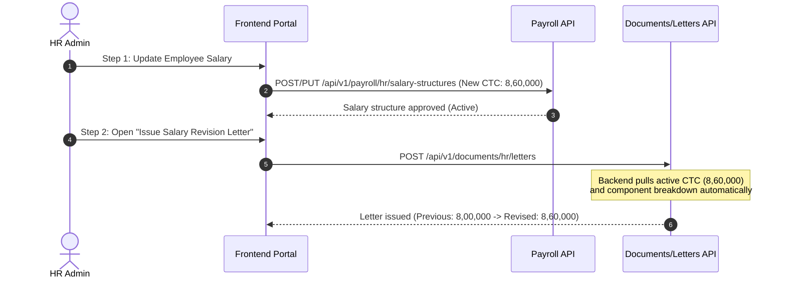

# Frontend Integration Guide: Salary Revision Letter Issuance

**Date:** 2026-10-08  
**Target:** Frontend Engineers (HR Portal / Letter Issuance Modal)  
**API:** `POST /api/v1/documents/hr/letters` (`#139`)  
**Template Code:** `salary_revision_letter`  

---

## 1. Summary of Issue

When HR issues a **Salary Revision Letter**, entering a new salary amount (e.g., `8,60,000`) in the letter form has no effect or prints the old salary in both spots (`Previous: 8,00,000` & `Revised: 8,00,000`).

### Root Cause
1. In the backend, `revised_annual_ctc_text` and `compensation_lines` are **DERIVED** from the employee's live, approved salary structure in the **Payroll database** (`findCurrentApproved`).
2. The letter issuance API (`POST /api/v1/documents/hr/letters`) only generates and stamps the document—**it does not update the employee's payroll salary record**.
3. If HR has not applied and approved the new salary structure in Payroll first, the backend fetches the old approved salary structure (`8,00,000`), printing it as the revised salary.
4. If frontend sends `revised_annual_ctc_text` in `field_overrides`, backend rejects the request with:
   ```json
   {
     "success": false,
     "errorCode": "LETTER_FIELD_NOT_OVERRIDABLE",
     "message": "Field \"revised_annual_ctc_text\" is derived and cannot be overridden",
     "details": { "field": "revised_annual_ctc_text" }
   }
   ```

---

## 2. Correct Two-Step Workflow

For a Salary Revision Letter to reflect the new salary:



---

## 3. Frontend UI Requirements for `salary_revision_letter`

### 1. Form Inputs to Display
| Field Name | Type | Key in `field_overrides` | Required? | Notes |
|---|---|---|---|---|
| **Effective Date** | Text / Date picker | `effective_date_text` | **Yes** | Send preformatted string, e.g. `"01 October 2026"` |
| **Previous Annual CTC** | Text input | `previous_annual_ctc_text` | Optional | Send preformatted string, e.g. `"INR 8,00,000"` |
| **Closing Note** | Textarea | `closing_note` | Optional | Max 500 characters |

### 2. Fields That Must NOT Be User-Editable
- **DO NOT** render an editable text input for "Revised Annual CTC" or "Revised Salary" that posts to `field_overrides`.
- If showing the revised salary on the modal, display it as **read-only** (fetched from the employee's active salary structure).

### 3. Advisory Alert / Banner in Modal
Add a banner or tooltip inside the Salary Revision Letter modal:
> **Notice:** The revised compensation and breakdown are automatically pulled from the employee's currently active salary structure in Payroll. If you have not revised the employee's salary in Payroll yet, please update the salary structure first.

---

## 4. API Request & Payload Example

### Endpoint
`POST /api/v1/documents/hr/letters`

### Headers
```http
Authorization: Bearer <hr_token>
Content-Type: application/json
```

### Request Body
```json
{
  "template_code": "salary_revision_letter",
  "subject_user_id": "8a559a45-549b-4d4d-90e4-e229233d509d",
  "field_overrides": {
    "effective_date_text": "01 October 2026",
    "previous_annual_ctc_text": "INR 8,00,000",
    "closing_note": "Thank you for your valuable contributions to the organization."
  },
  "effective_date": "2026-10-01"
}
```

> **Note:** Do NOT include `revised_annual_ctc_text`, `compensation_lines`, `employee_name`, `employee_code`, or `designation` inside `field_overrides`. The backend derives all of them automatically.
